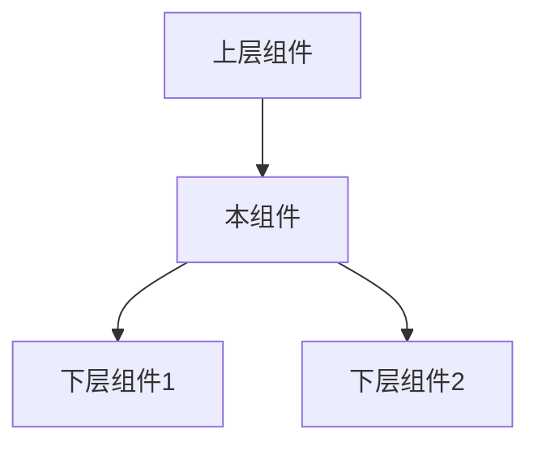
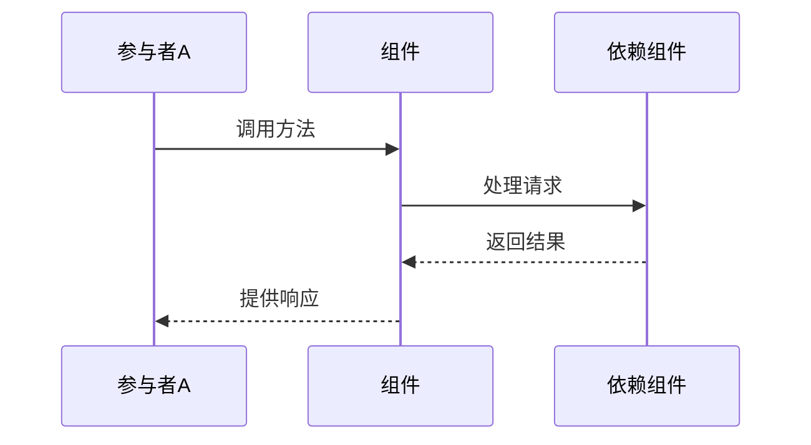

# 组件名称 - 功能说明

> **创建时间**: 2025-04-08 22:27:32
> **创建者**: Claude-3.7-Sonnet
> **最后修改**: 2025-04-08 22:27:32
> **文档类型**: 组件设计文档

## 文档概述

本文档详细描述了[组件名称]的设计、实现和使用方法。该组件负责[简要描述组件主要职责]，是A4-数据同步框架2.0中的核心组件之一。文档内容包括架构设计、API参考、实现细节、测试策略以及使用示例。

## 内部索引
- [背景与目标](#背景与目标)
- [架构设计](#架构设计)
- [API设计](#api设计)
- [实现细节](#实现细节)
- [测试策略](#测试策略)
- [使用示例](#使用示例)
- [性能指标](#性能指标)
- [问题与解决方案](#问题与解决方案)
- [未来计划](#未来计划)
- [修订历史](#修订历史)

## 背景与目标

### 背景

[描述开发该组件的背景、行业现状和技术挑战]

### 目标

1. [具体目标1]
2. [具体目标2]
3. [具体目标3]

### 非目标

1. [非本组件职责范围1]
2. [非本组件职责范围2]

## 架构设计

### 整体架构

[描述组件在整个框架中的位置和作用]



### 内部结构

[描述组件内部结构和模块划分]

### 核心流程

[描述组件核心业务流程]



## API设计

### 公开接口

#### 方法1

```javascript
/**
 * 方法描述
 * @param {类型} 参数名 - 参数描述
 * @param {类型} 参数名 - 参数描述
 * @returns {类型} 返回值描述
 * @throws {错误类型} 错误描述
 */
function 方法名(参数1, 参数2) {
  // 实现示例
}
```

#### 方法2

```javascript
/**
 * 方法描述
 * @param {类型} 参数名 - 参数描述
 * @param {类型} 参数名 - 参数描述
 * @returns {类型} 返回值描述
 * @throws {错误类型} 错误描述
 */
function 方法名(参数1, 参数2) {
  // 实现示例
}
```

### 事件

| 事件名称 | 触发条件 | 事件数据 | 使用场景 |
|---------|----------|---------|----------|
| 事件1   | 触发条件  | 数据结构 | 使用场景 |
| 事件2   | 触发条件  | 数据结构 | 使用场景 |

### 配置选项

| 选项名称 | 类型 | 默认值 | 说明 |
|---------|------|-------|------|
| 选项1   | 类型 | 默认值 | 说明 |
| 选项2   | 类型 | 默认值 | 说明 |

## 实现细节

### 数据结构

[描述组件使用的核心数据结构]

```javascript
// 数据结构示例
var 数据结构 = {
  属性1: 类型,
  属性2: 类型
};
```

### 核心算法

[描述组件中使用的核心算法和处理逻辑]

### 性能优化

[描述为提高性能采取的优化措施]

### 错误处理

[描述组件的错误处理策略和机制]

| 错误码 | 错误描述 | 处理方式 |
|-------|---------|---------|
| E001  | 错误描述 | 处理方式 |
| E002  | 错误描述 | 处理方式 |

## 测试策略

### 单元测试

[描述组件单元测试策略和覆盖范围]

### 集成测试

[描述与其他组件集成测试的策略]

### 性能测试

[描述性能测试方法和指标]

## 使用示例

### 基本用法

```javascript
// 示例代码
var 实例 = new 组件();
实例.方法1(参数);
```

### 高级用法

```javascript
// 高级用法示例
var 实例 = new 组件({
  选项1: 值,
  选项2: 值
});
实例.on('事件1', function(data) {
  // 处理事件
});
```

## 性能指标

| 指标名称 | 预期值 | 测试方法 | 测试环境 |
|---------|-------|---------|---------|
| 指标1   | 预期值 | 测试方法 | 测试环境 |
| 指标2   | 预期值 | 测试方法 | 测试环境 |

## 问题与解决方案

### 已知问题

[列出已知的问题和限制]

### 常见问题解答

[提供常见问题及解决方案]

## 未来计划

[描述组件未来的演进计划]

1. [计划1]
2. [计划2]
3. [计划3]

## 修订历史

| 日期 | 版本 | 修改内容 | 修改人 |
|------|------|---------|-------|
| 2025-04-08 | 1.0 | 初始版本 | Claude-3.7-Sonnet | 