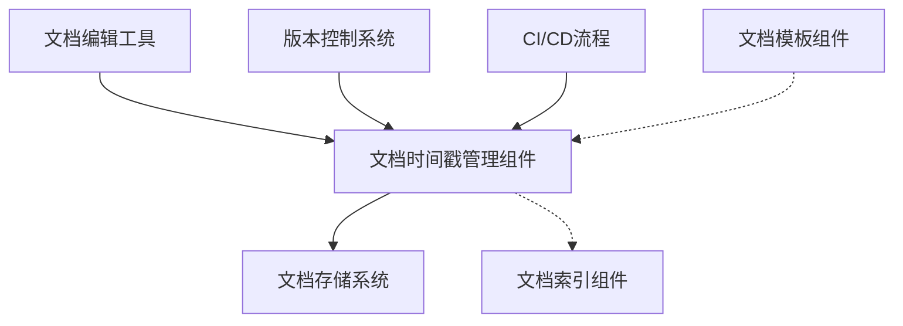
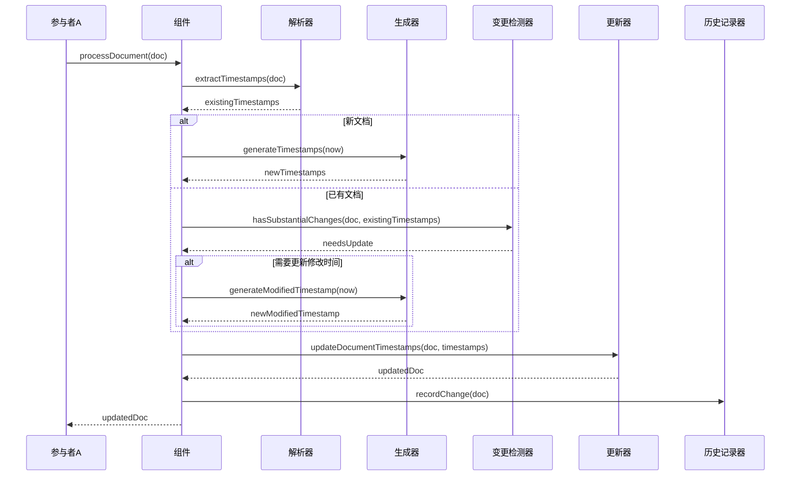

# A4.12 文档时间戳管理组件 - 设计与实现

> **创建时间**: 2025-04-08 22:27:32
> **创建者**: Claude-3.7-Sonnet
> **最后修改**: 2025-04-08 22:27:32
> **文档类型**: 组件设计文档

## 文档概述

本文档详细描述了文档时间戳管理组件的设计、实现和使用方法。该组件负责为文档自动添加创建时间和修改时间的时间戳，并在文档更新时智能维护这些时间信息，是A4-数据同步框架2.0文档子系统中的核心工具组件。文档内容包括架构设计、API参考、实现细节、测试策略以及使用示例。

## 内部索引
- [背景与目标](#背景与目标)
- [架构设计](#架构设计)
- [API设计](#api设计)
- [实现细节](#实现细节)
- [测试策略](#测试策略)
- [使用示例](#使用示例)
- [性能指标](#性能指标)
- [问题与解决方案](#问题与解决方案)
- [未来计划](#未来计划)
- [修订历史](#修订历史)

## 背景与目标

### 背景

在专业文档管理系统中，准确记录文档的创建和修改时间是确保文档可追溯性和管理有效性的关键。尤其在团队协作开发环境中，了解文档的创建者、创建时间以及最后修改时间对于理解文档的时效性和权威性至关重要。

A4-数据同步框架2.0项目对文档标准提出了严格要求，其中包括所有文档必须包含准确的时间戳信息。然而，手动维护这些时间戳容易出错，且在频繁更新文档时造成额外负担。因此，需要一个自动化的时间戳管理组件来解决这一问题。

### 目标

1. 自动为新创建的文档添加标准格式的创建时间和创建者信息
2. 在文档更新时自动更新修改时间，同时保留原创建时间不变
3. 支持多种时间戳格式，确保时间信息的一致性和可读性
4. 与文档编辑工具和版本控制系统集成，提供无缝的时间戳管理体验
5. 提供追踪文档历史修改记录的能力，支持完整的文档版本追溯

### 非目标

1. 不替代完整的版本控制系统
2. 不负责文档内容的备份或恢复
3. 不提供完整的文档差异比较功能
4. 不负责用户身份验证或权限管理

## 架构设计

### 整体架构

文档时间戳管理组件在整个文档系统中的位置如下：



### 内部结构

组件内部由以下几个模块组成：

1. **时间戳解析器**：负责从文档中提取现有的时间戳信息
2. **时间戳生成器**：根据配置生成标准格式的时间戳
3. **文档更新器**：负责在文档中更新或添加时间戳信息
4. **变更检测器**：检测文档是否发生实质性变更，决定是否更新修改时间
5. **配置管理器**：管理时间戳格式、位置等配置项
6. **历史记录器**：记录文档的修改历史

### 核心流程

文档时间戳管理的核心流程如下：



## API设计

### 公开接口

#### processDocument

```javascript
/**
 * 处理文档时间戳
 * @param {string} docContent - 文档内容
 * @param {Object} options - 配置选项
 * @param {string} options.authorName - 作者名称，用于新文档
 * @param {string} options.dateFormat - 日期格式，默认为"YYYY-MM-DD HH:mm:ss"
 * @param {boolean} options.forceUpdate - 是否强制更新修改时间，默认为false
 * @returns {string} 更新后的文档内容
 * @throws {TimestampError} 时间戳处理错误
 */
function processDocument(docContent, options) {
  // 实现逻辑
}
```

#### extractTimestamps

```javascript
/**
 * 从文档中提取时间戳信息
 * @param {string} docContent - 文档内容
 * @returns {Object} 时间戳信息对象，包含创建时间、修改时间、创建者等
 * @throws {ParseError} 解析错误
 */
function extractTimestamps(docContent) {
  // 实现逻辑
}
```

#### generateTimestamps

```javascript
/**
 * 生成完整的时间戳信息
 * @param {Date} timestamp - 时间戳时间，默认为当前时间
 * @param {string} author - 作者名称
 * @param {Object} options - 配置选项
 * @returns {Object} 生成的时间戳信息对象
 */
function generateTimestamps(timestamp, author, options) {
  // 实现逻辑
}
```

#### updateDocumentHistory

```javascript
/**
 * 更新文档的修改历史记录
 * @param {string} docContent - 文档内容
 * @param {Object} changeInfo - 变更信息
 * @returns {string} 更新后的文档内容
 */
function updateDocumentHistory(docContent, changeInfo) {
  // 实现逻辑
}
```

### 事件

| 事件名称 | 触发条件 | 事件数据 | 使用场景 |
|---------|----------|---------|----------|
| onTimestampUpdated | 时间戳更新完成 | {docPath, oldTimestamps, newTimestamps} | 用于记录时间戳变更日志 |
| onNewDocumentCreated | 检测到新文档 | {docPath, author, timestamp} | 用于记录新文档创建事件 |
| onError | 出现错误 | {error, docPath} | 用于错误报告和处理 |

### 配置选项

| 选项名称 | 类型 | 默认值 | 说明 |
|---------|------|-------|------|
| dateFormat | string | "YYYY-MM-DD HH:mm:ss" | 时间戳的日期格式 |
| timestampHeader | string | "> **创建时间**: " | 创建时间的标头文本 |
| modifiedHeader | string | "> **最后修改**: " | 修改时间的标头文本 |
| authorHeader | string | "> **创建者**: " | 创建者的标头文本 |
| historyEnabled | boolean | true | 是否启用修改历史记录功能 |
| minChangeInterval | number | 60000 | 最小允许修改时间间隔（毫秒） |

## 实现细节

### 数据结构

时间戳信息对象的数据结构：

```javascript
// 时间戳信息对象
var timestamps = {
  created: {
    date: "2025-04-08 22:27:32",
    line: 3 // 在文档中的行号
  },
  modified: {
    date: "2025-04-08 22:27:32",
    line: 4
  },
  author: {
    name: "Claude-3.7-Sonnet",
    line: 5
  },
  history: [
    {
      date: "2025-04-08 22:27:32",
      author: "Claude-3.7-Sonnet",
      type: "创建"
    }
  ]
};
```

### 核心算法

1. **时间戳提取算法**：
   - 使用正则表达式匹配Markdown文档中的时间戳头信息
   - 解析时间格式，转换为标准JavaScript Date对象
   - 提取创建者信息和历史记录

2. **变更检测算法**：
   - 计算文档内容的哈希值，与上次修改时比较
   - 忽略时间戳行的变更，只关注实质内容变更
   - 应用时间间隔规则，避免频繁更新时间戳

3. **时间戳更新算法**：
   - 在文档中定位时间戳位置
   - 替换或添加时间戳信息
   - 保持文档格式和样式的一致性

### 性能优化

1. **解析优化**：
   - 使用高效的正则表达式匹配时间戳
   - 只解析文档头部，不处理整个文档
   - 缓存解析结果，避免重复解析

2. **更新优化**：
   - 仅在必要时更新文档
   - 批量处理多个时间戳更新
   - 使用差异更新，只替换变化的部分

### 错误处理

| 错误码 | 错误描述 | 处理方式 |
|-------|---------|---------|
| E101 | 时间戳格式错误 | 尝试修复格式，或使用当前时间 |
| E102 | 缺少创建时间 | 添加当前时间作为创建时间 |
| E103 | 缺少作者信息 | 使用配置中的默认作者或系统用户 |
| E104 | 时间戳更新失败 | 保留原始文档，记录错误 |

## 测试策略

### 单元测试

1. **解析器测试**：
   - 测试各种格式时间戳的解析
   - 测试不完整时间戳信息的处理
   - 测试错误格式的处理
   - 测试边界情况（无时间戳、多个时间戳等）

2. **生成器测试**：
   - 测试不同格式时间戳的生成
   - 测试时区处理
   - 测试各种配置选项的效果

3. **更新器测试**：
   - 测试时间戳位置查找
   - 测试时间戳替换功能
   - 测试新时间戳插入功能
   - 测试历史记录维护功能

### 集成测试

1. 测试与文档编辑工具的集成
2. 测试与版本控制系统的集成
3. 测试在CI/CD流程中的使用

### 性能测试

1. 测试大型文档的处理性能
2. 测试批量处理多个文档的性能
3. 测试频繁更新文档的性能影响

## 使用示例

### 基本用法

```javascript
// 引入组件
var timestampManager = require('./timestampManager');

// 读取文档内容
var docContent = readFile('document.md');

// 处理时间戳
var updatedDoc = timestampManager.processDocument(docContent, {
  authorName: 'Claude-3.7-Sonnet'
});

// 保存更新后的文档
writeFile('document.md', updatedDoc);
```

### 高级用法

```javascript
// 自定义配置
var options = {
  authorName: 'Claude-3.7-Sonnet',
  dateFormat: 'YYYY/MM/DD HH:mm',
  forceUpdate: true,
  historyEnabled: true,
  minChangeInterval: 300000 // 5分钟
};

// 处理文档
var updatedDoc = timestampManager.processDocument(docContent, options);

// 或者手动提取时间戳
var timestamps = timestampManager.extractTimestamps(docContent);
console.log(JSON.stringify(timestamps, null, 2));

// 添加历史记录
updatedDoc = timestampManager.updateDocumentHistory(updatedDoc, {
  type: '修改',
  description: '更新API文档'
});
```

## 性能指标

| 指标名称 | 预期值 | 测试方法 | 测试环境 |
|---------|-------|---------|---------|
| 解析速度 | <10ms | 使用标准文档测试 | 标准开发环境 |
| 更新速度 | <20ms | 使用标准文档测试 | 标准开发环境 |
| 批处理速度 | <100文档/秒 | 批量处理100个文档 | 标准开发环境 |

## 问题与解决方案

### 已知问题

1. 非标准格式的时间戳可能无法正确解析
2. 极短时间内多次更新可能导致时间戳不更新
3. 跨时区协作可能导致时间戳不一致

### 常见问题解答

1. **Q: 如何处理已有不同格式的时间戳？**  
   A: 组件会尝试识别多种常见格式，并转换为标准格式。如果识别失败，会记录警告并保留原格式。

2. **Q: 如何确保创建时间不被覆盖？**  
   A: 组件会先解析现有时间戳，只更新修改时间，保留原始创建时间。

3. **Q: 组件如何区分实质性修改和微小修改？**  
   A: 组件使用内容哈希比较和变更比例计算，可通过minChangeThreshold配置阈值。

## 未来计划

1. 支持更多自定义时间戳格式和位置
2. 添加文档变更差异摘要功能
3. 提供图形化时间戳管理界面
4. 增强与多种版本控制系统的集成

## 修订历史

| 日期 | 版本 | 修改内容 | 修改人 |
|------|------|---------|-------|
| 2025-04-08 | 1.0 | 初始版本 | Claude-3.7-Sonnet | 