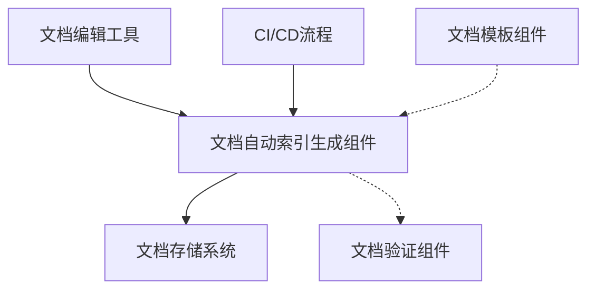
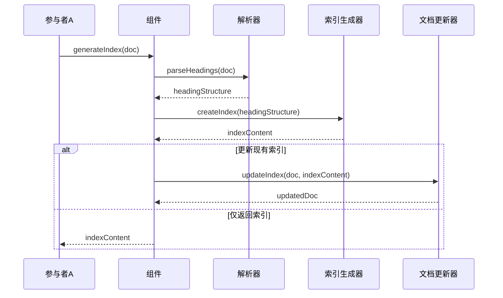

# A4.11 文档自动索引生成组件 - 设计与实现

> **创建时间**: 2025-04-08 22:27:32
> **创建者**: Claude-3.7-Sonnet
> **最后修改**: 2025-04-08 22:27:32
> **文档类型**: 组件设计文档

## 文档概述

本文档详细描述了文档自动索引生成组件的设计、实现和使用方法。该组件负责在文档中自动生成内部链接索引，使文档更易于浏览和阅读，是A4-数据同步框架2.0文档子系统中的重要工具组件。文档内容包括架构设计、API参考、实现细节、测试策略以及使用示例。

## 内部索引
- [背景与目标](#背景与目标)
- [架构设计](#架构设计)
- [API设计](#api设计)
- [实现细节](#实现细节)
- [测试策略](#测试策略)
- [使用示例](#使用示例)
- [性能指标](#性能指标)
- [问题与解决方案](#问题与解决方案)
- [未来计划](#未来计划)
- [修订历史](#修订历史)

## 背景与目标

### 背景

在大型技术文档项目中，文档内容往往结构复杂，包含多个层级的标题和内容。为了便于读者快速定位和跳转到所需内容，文档通常需要在开头提供一个内部索引。然而，手动维护这些索引非常耗时，且容易出错，特别是在文档频繁更新的场景下。

A4-数据同步框架2.0项目中的所有文档都需要遵循严格的文档标准，其中要求每个文档必须包含内部索引。为了确保索引的准确性和一致性，同时减轻文档维护的负担，我们需要一个自动化的索引生成组件。

### 目标

1. 自动解析Markdown文档中的标题结构，生成准确的内部链接索引
2. 支持多级标题索引，可配置索引深度（如仅包含H1、H2，或深入到H3、H4）
3. 支持自动更新现有索引，识别文档中的索引区域并替换
4. 提供简单易用的API，可集成到文档编辑工具或CI/CD流程中
5. 确保生成的索引遵循项目的文档标准规范

### 非目标

1. 不负责文档的其他部分的格式化或修改
2. 不替代完整的文档管理系统
3. 不负责文档版本控制或发布流程

## 架构设计

### 整体架构

文档自动索引生成组件在整个文档系统中的位置如下：



### 内部结构

组件内部由以下几个模块组成：

1. **解析器模块**：负责解析Markdown文档，提取标题结构
2. **索引生成模块**：根据提取的标题生成符合格式的Markdown索引
3. **文档更新模块**：负责在文档中找到索引位置并更新
4. **配置管理模块**：管理索引生成的各种配置选项
5. **错误处理模块**：处理文档解析、索引生成过程中的各种异常情况

### 核心流程

文档索引生成的核心流程如下：



## API设计

### 公开接口

#### generateIndex

```javascript
/**
 * 解析文档并生成内部索引
 * @param {string} docContent - 文档内容
 * @param {Object} options - 配置选项
 * @param {number} options.maxDepth - 索引最大深度，默认为3
 * @param {boolean} options.updateInPlace - 是否在文档中更新索引，默认为true
 * @param {string} options.indexMarker - 索引标记，用于定位索引位置，默认为"## 内部索引"
 * @returns {string} 更新后的文档内容或只有索引的内容
 * @throws {ParseError} 解析错误
 * @throws {IndexGenerationError} 索引生成错误
 */
function generateIndex(docContent, options) {
  // 实现逻辑
}
```

#### parseHeadings

```javascript
/**
 * 解析文档中的标题结构
 * @param {string} docContent - 文档内容
 * @param {number} maxDepth - 最大解析深度，默认为6
 * @returns {Array} 标题结构数组
 * @throws {ParseError} 解析错误
 */
function parseHeadings(docContent, maxDepth) {
  // 实现逻辑
}
```

#### createIndexContent

```javascript
/**
 * 根据标题结构创建索引内容
 * @param {Array} headings - 标题结构数组
 * @param {Object} options - 配置选项
 * @returns {string} 索引内容
 */
function createIndexContent(headings, options) {
  // 实现逻辑
}
```

### 事件

| 事件名称 | 触发条件 | 事件数据 | 使用场景 |
|---------|----------|---------|----------|
| onIndexGenerated | 索引生成完成 | {docPath, indexContent} | 用于记录或通知索引生成完成 |
| onError | 出现错误 | {error, docPath} | 用于错误报告和处理 |

### 配置选项

| 选项名称 | 类型 | 默认值 | 说明 |
|---------|------|-------|------|
| maxDepth | number | 3 | 索引最大深度，1表示仅H1，2表示H1+H2，依此类推 |
| updateInPlace | boolean | true | 是否在文档中直接更新索引 |
| indexMarker | string | "## 内部索引" | 用于定位索引位置的标记 |
| includeIntro | boolean | false | 是否在索引前包含介绍文本 |
| bulletStyle | string | "-" | 索引项的列表样式，可选"-"、"*"、"+" |

## 实现细节

### 数据结构

标题结构数组的数据结构：

```javascript
// 标题结构数组
var headings = [
  {
    level: 1, // 标题级别：1=h1, 2=h2, ...
    text: "标题文本", // 标题文本内容
    slug: "标题-文本", // 用于链接的slug
    line: 10, // 标题在文档中的行号
    children: [] // 子标题数组
  }
];
```

### 核心算法

1. **标题提取算法**：
   - 使用正则表达式匹配Markdown标题格式（`#`、`##`等）
   - 分析标题层级关系，构建树状结构
   - 处理特殊字符，生成有效的锚点链接

2. **索引生成算法**：
   - 递归遍历标题树，按照配置的最大深度生成索引项
   - 根据标题级别添加适当的缩进
   - 生成符合Markdown语法的链接格式

3. **索引更新算法**：
   - 在文档中定位索引区域（使用indexMarker标记）
   - 如果找到现有索引，替换为新生成的索引
   - 如果没有找到，在适当位置插入新索引

### 性能优化

1. **解析优化**：
   - 使用高效的正则表达式匹配标题
   - 一次遍历完成标题提取和树状结构构建
   - 避免不必要的字符串操作

2. **内存优化**：
   - 避免存储完整文档内容的副本
   - 使用行号引用代替存储行内容
   - 按需计算索引，不预生成不需要的深度

### 错误处理

| 错误码 | 错误描述 | 处理方式 |
|-------|---------|---------|
| E001 | 文档解析错误 | 记录详细错误位置，返回有用的错误消息 |
| E002 | 标题结构不规范 | 尝试进行最佳恢复，记录警告 |
| E003 | 索引位置标记缺失 | 使用默认位置（文档开头或第一个标题前）|
| E004 | 文档更新失败 | 只返回索引内容，不修改原文档 |

## 测试策略

### 单元测试

1. **解析器测试**：
   - 测试各种标题格式解析
   - 测试多级标题的层级关系构建
   - 测试特殊字符处理
   - 测试边界情况（无标题、全是标题等）

2. **索引生成器测试**：
   - 测试不同深度的索引生成
   - 测试各种配置选项的效果
   - 测试不同链接样式的生成

3. **文档更新器测试**：
   - 测试索引位置查找
   - 测试索引替换功能
   - 测试新索引插入功能

### 集成测试

1. 测试与文档编辑工具的集成
2. 测试在CI/CD流程中的使用
3. 测试与其他文档工具的兼容性

### 性能测试

1. 测试大型文档的处理性能
2. 测试包含复杂标题结构的文档处理效率
3. 测试批量处理多个文档的性能

## 使用示例

### 基本用法

```javascript
// 引入组件
var docIndexer = require('./docIndexer');

// 读取文档内容
var docContent = readFile('document.md');

// 生成并更新索引
var updatedDoc = docIndexer.generateIndex(docContent, {
  maxDepth: 3,
  updateInPlace: true
});

// 保存更新后的文档
writeFile('document.md', updatedDoc);
```

### 高级用法

```javascript
// 自定义配置
var options = {
  maxDepth: 2,
  updateInPlace: false,
  indexMarker: "<!-- TOC -->",
  includeIntro: true,
  bulletStyle: "*"
};

// 只生成索引，不更新文档
var indexContent = docIndexer.generateIndex(docContent, options);

// 手动处理索引内容
console.log(indexContent);

// 或者直接解析标题结构
var headings = docIndexer.parseHeadings(docContent);
console.log(JSON.stringify(headings, null, 2));
```

## 性能指标

| 指标名称 | 预期值 | 测试方法 | 测试环境 |
|---------|-------|---------|---------|
| 解析速度 | <100ms/MB | 使用10MB大文档测试 | 标准开发环境 |
| 内存占用 | <50MB | 处理大型文档监控内存 | 标准开发环境 |
| CPU使用率 | <10% | 连续处理多个文档 | 标准开发环境 |

## 问题与解决方案

### 已知问题

1. 特殊格式的Markdown标题可能无法正确解析
2. 非标准Markdown语法可能导致索引生成不准确
3. 极大文档可能导致性能问题

### 常见问题解答

1. **Q: 如何处理已有的手动索引？**  
   A: 组件会自动识别指定标记之后的内容为索引，并替换为新生成的索引。

2. **Q: 如何自定义索引的格式？**  
   A: 通过options参数可以自定义索引的深度、样式和位置标记。

3. **Q: 组件是否支持多语言文档？**  
   A: 支持，组件处理基于Markdown语法，与文档语言无关。

## 未来计划

1. 支持更多自定义索引格式
2. 添加对非Markdown格式文档的支持
3. 实现可视化索引编辑界面
4. 添加智能索引优化建议功能

## 修订历史

| 日期 | 版本 | 修改内容 | 修改人 |
|------|------|---------|-------|
| 2025-04-08 | 1.0 | 初始版本 | Claude-3.7-Sonnet | 