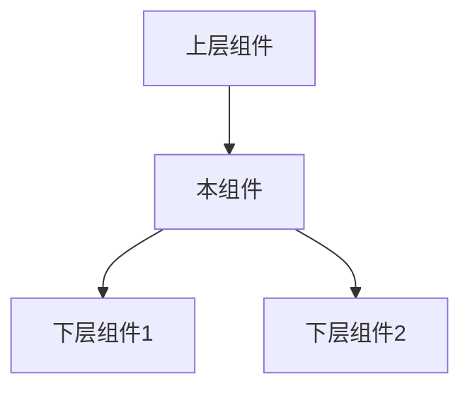
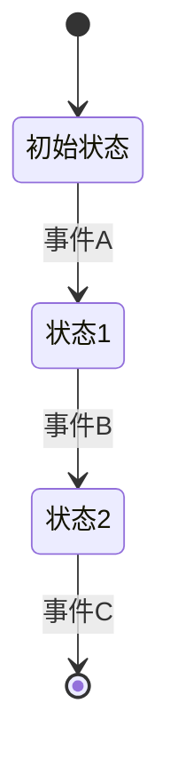

# [组件ID] [组件名称] 开发任务

> **创建时间**: 2025-04-08 22:27:32
> **创建者**: Claude-3.7-Sonnet
> **优先级**: [高/中/低]
> **预计工时**: [X小时]
> **任务状态**: 待开始

## 任务概述

本文档定义了[组件名称]的开发任务，包括需求规格、实现步骤、验收标准和交付物。该组件负责[简述组件主要职责]，是A4-数据同步框架2.0系统中的[核心/辅助]组件。

## 内部索引
- [组件职责](#组件职责)
- [需求规格](#需求规格)
- [技术规格](#技术规格)
- [实现步骤](#实现步骤)
- [测试要求](#测试要求)
- [验收标准](#验收标准)
- [交付物](#交付物)
- [任务进度](#任务进度)

## 组件职责

### 核心职责

[详细描述组件的核心职责和功能边界]

### 与其他组件的关系



| 相关组件 | 关系类型 | 交互方式 | 依赖方向 |
|---------|---------|---------|---------|
| 组件1   | 被依赖  | API调用 | 单向依赖 |
| 组件2   | 依赖    | 事件    | 单向依赖 |

## 需求规格

### 功能需求

1. **[功能1]**
   - 详细描述
   - 输入/输出
   - 处理逻辑

2. **[功能2]**
   - 详细描述
   - 输入/输出
   - 处理逻辑

3. **[功能3]**
   - 详细描述
   - 输入/输出
   - 处理逻辑

### 非功能需求

1. **性能需求**
   - 响应时间：[具体指标]
   - 吞吐量：[具体指标]
   - 资源占用：[具体指标]

2. **可靠性需求**
   - 错误处理：[具体策略]
   - 恢复机制：[具体机制]
   - 容错能力：[具体表现]

3. **兼容性需求**
   - 环境兼容：[具体要求]
   - 版本兼容：[具体策略]
   - 数据兼容：[具体标准]

## 技术规格

### API设计

#### 公开方法

```javascript
/**
 * 方法描述
 * @param {类型} 参数1 - 描述
 * @param {类型} 参数2 - 描述
 * @returns {类型} 返回值描述
 * @throws {错误类型} 错误描述
 */
function 方法名(参数1, 参数2) {
  // 实现逻辑
}
```

#### 事件

| 事件名称 | 触发条件 | 负载数据 | 处理建议 |
|---------|---------|---------|---------|
| 事件1   | 条件描述 | 数据结构 | 处理建议 |
| 事件2   | 条件描述 | 数据结构 | 处理建议 |

### 数据结构

```javascript
// 核心数据结构
var 数据结构 = {
  属性1: 类型, // 说明
  属性2: 类型  // 说明
};
```

### 状态管理

[描述组件的状态管理机制和状态转换逻辑]



### 异常处理

| 错误类型 | 错误码 | 处理策略 | 用户反馈 |
|---------|-------|---------|---------|
| 错误1   | E001  | 处理方法 | 提示消息 |
| 错误2   | E002  | 处理方法 | 提示消息 |

## 实现步骤

1. **环境准备**
   - [ ] 创建组件文件结构
   - [ ] 配置开发环境
   - [ ] 加载依赖组件

2. **测试准备**
   - [ ] 创建测试文件
   - [ ] 准备测试数据
   - [ ] 设置测试环境

3. **核心实现**
   - [ ] 实现基础结构
   - [ ] 实现核心算法
   - [ ] 实现API接口
   - [ ] 实现事件机制
   - [ ] 实现错误处理

4. **性能优化**
   - [ ] 代码效率优化
   - [ ] 内存使用优化
   - [ ] 响应时间优化

5. **文档完善**
   - [ ] 完成API文档
   - [ ] 编写使用示例
   - [ ] 生成开发报告

## 测试要求

### 测试范围

1. **单元测试**
   - [ ] 所有公共方法
   - [ ] 所有私有方法
   - [ ] 所有错误路径
   - [ ] 边界条件

2. **集成测试**
   - [ ] 与依赖组件交互
   - [ ] 与被依赖组件交互
   - [ ] 完整流程测试

3. **性能测试**
   - [ ] 响应时间测试
   - [ ] 内存占用测试
   - [ ] 负载测试
   - [ ] 长时间运行测试

### 测试数据

[描述测试所需的数据集和生成方法]

## 验收标准

1. **功能验收**
   - [ ] 所有功能按规格实现
   - [ ] 所有API符合设计规范
   - [ ] 所有用例测试通过

2. **质量验收**
   - [ ] 代码符合编码规范
   - [ ] 测试覆盖率100%
   - [ ] 无严重或主要问题

3. **性能验收**
   - [ ] 响应时间符合要求
   - [ ] 资源占用符合要求
   - [ ] 高负载下稳定运行

4. **文档验收**
   - [ ] API文档完整准确
   - [ ] 使用示例清晰有效
   - [ ] 所有设计决策有记录

## 交付物

1. **代码文件**
   - [ ] [组件名].js
   - [ ] [组件名].test.js

2. **文档文件**
   - [ ] API参考文档
   - [ ] 设计说明文档
   - [ ] 使用示例文档

3. **测试报告**
   - [ ] 测试覆盖率报告
   - [ ] 性能测试报告
   - [ ] 代码质量报告

## 任务进度

| 阶段 | 计划开始时间 | 计划结束时间 | 实际开始时间 | 实际结束时间 | 状态 |
|------|------------|------------|------------|------------|------|
| 需求分析 | [日期] | [日期] | - | - | ⬜ 待开始 |
| 设计阶段 | [日期] | [日期] | - | - | ⬜ 待开始 |
| 测试开发 | [日期] | [日期] | - | - | ⬜ 待开始 |
| 实现阶段 | [日期] | [日期] | - | - | ⬜ 待开始 |
| 性能优化 | [日期] | [日期] | - | - | ⬜ 待开始 |
| 文档完善 | [日期] | [日期] | - | - | ⬜ 待开始 |
| 最终验收 | [日期] | [日期] | - | - | ⬜ 待开始 | 