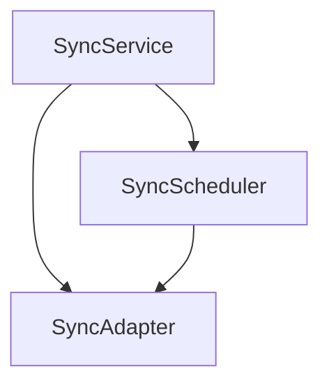

# 核心同步框架组接口契约

> **创建时间**: 2025-04-08 23:20:55
> **创建者**: Claude-3.7-Sonnet
> **文档分类**: 接口契约文档
> **业务能力组**: A4.1 核心同步框架组
> **契约版本**: v1.0.0
> **契约稳定性**: 实验
> **破坏性变更**: 可能

## 文档概述

本文档定义了A4-数据同步框架2.0核心同步框架组的接口契约，明确了核心同步引擎和调度机制的标准接口。该契约规范了SyncService、SyncAdapter和SyncScheduler之间的交互方式，为整个同步框架提供稳定的基础。

## 内部索引
- [组件关系](#组件关系)
- [SyncService接口](#syncservice接口)
- [SyncAdapter接口](#syncadapter接口)
- [SyncScheduler接口](#syncscheduler接口)
- [错误处理](#错误处理)
- [调用示例](#调用示例)
- [依赖说明](#依赖说明)
- [稳定性承诺](#稳定性承诺)

## 组件关系

核心同步框架组包含三个主要组件，它们的关系如下：



- **SyncService**: 作为对外统一接口，封装同步功能并协调其他组件
- **SyncAdapter**: 负责适配不同同步协议和接口，实现底层同步逻辑
- **SyncScheduler**: 调度和管理同步任务，控制同步频率和优先级

## SyncService接口

```javascript
/**
 * 同步服务
 * 提供统一的数据同步API，是应用与同步框架交互的主要入口点
 * @module A4/sync
 */

/**
 * 同步服务配置选项
 * @typedef {Object} SyncOptions
 * @property {string} storageKey - 本地存储的键名
 * @property {string} serverUrl - 同步服务器URL
 * @property {number} [syncInterval=60000] - 同步间隔(毫秒)
 * @property {string} [conflictStrategy='server-wins'] - 冲突解决策略
 * @property {boolean} [offlineEnabled=true] - 是否启用离线支持
 * @property {Object} [headers] - 请求头
 * @property {Function} [onSyncStart] - 同步开始回调
 * @property {Function} [onSyncComplete] - 同步完成回调
 * @property {Function} [onSyncError] - 同步错误回调
 */

/**
 * 同步结果
 * @typedef {Object} SyncResult
 * @property {number} added - 新增数据条数
 * @property {number} updated - 更新数据条数
 * @property {number} deleted - 删除数据条数
 * @property {number} conflicts - 冲突数据条数
 * @property {Date} timestamp - 同步时间戳
 * @property {string} status - 同步状态
 */

/**
 * 同步服务接口
 * 提供统一的数据同步API
 * @interface ISyncService
 */
var ISyncService = {
    /**
     * 初始化同步服务
     * 
     * @param {SyncOptions} [options] - 同步选项
     * @returns {Promise<void>} 初始化完成的Promise
     * @throws {SyncError} 初始化失败时抛出错误
     */
    init: function(options) {},
    
    /**
     * 触发同步操作
     * 
     * @param {Object} [options] - 同步选项
     * @param {boolean} [options.force=false] - 是否强制同步
     * @param {string} [options.scope] - 同步范围
     * @returns {Promise<SyncResult>} 同步结果
     * @throws {SyncError} 同步失败时抛出错误
     */
    sync: function(options) {},
    
    /**
     * 获取同步数据
     * 
     * @param {string} key - 数据键名
     * @param {Object} [options] - 获取选项
     * @param {boolean} [options.forceRefresh=false] - 是否强制刷新
     * @returns {Promise<Object>} 数据对象
     * @throws {SyncError} 获取失败时抛出错误
     */
    getData: function(key, options) {},
    
    /**
     * 更新同步数据
     * 
     * @param {string} key - 数据键名
     * @param {Object} data - 更新的数据
     * @param {Object} [options] - 更新选项
     * @param {boolean} [options.immediate=false] - 是否立即同步
     * @returns {Promise<void>} 更新完成的Promise
     * @throws {SyncError} 更新失败时抛出错误
     */
    updateData: function(key, data, options) {},
    
    /**
     * 删除同步数据
     * 
     * @param {string} key - 数据键名
     * @param {Object} [options] - 删除选项
     * @param {boolean} [options.softDelete=true] - 是否软删除
     * @returns {Promise<void>} 删除完成的Promise
     * @throws {SyncError} 删除失败时抛出错误
     */
    deleteData: function(key, options) {},
    
    /**
     * 设置冲突解决器
     * 
     * @param {Function} resolver - 冲突解决器函数
     * @returns {void}
     */
    setConflictResolver: function(resolver) {},
    
    /**
     * 获取同步状态
     * 
     * @returns {string} 同步状态
     */
    getStatus: function() {},
    
    /**
     * 获取最后同步时间
     * 
     * @returns {Date} 最后同步时间
     */
    getLastSyncTime: function() {},
    
    /**
     * 注册事件监听器
     * 
     * @param {string} event - 事件名称
     * @param {Function} handler - 事件处理函数
     * @returns {void}
     */
    on: function(event, handler) {},
    
    /**
     * 移除事件监听器
     * 
     * @param {string} event - 事件名称
     * @param {Function} handler - 事件处理函数
     * @returns {void}
     */
    off: function(event, handler) {}
};
```

## SyncAdapter接口

```javascript
/**
 * 同步适配器
 * 适配不同同步协议和接口，实现底层同步逻辑
 * @module A4/sync/adapter
 */

/**
 * 同步适配器配置选项
 * @typedef {Object} AdapterOptions
 * @property {string} serverUrl - 同步服务器URL
 * @property {string} [protocol='rest'] - 同步协议
 * @property {Object} [headers] - 请求头
 * @property {number} [timeout=30000] - 超时时间(毫秒)
 * @property {number} [retries=3] - 重试次数
 */

/**
 * 同步请求参数
 * @typedef {Object} SyncRequest
 * @property {string} scope - 同步范围
 * @property {Date} since - 上次同步时间
 * @property {Object} changes - 本地变更
 * @property {string} [checksum] - 数据校验和
 */

/**
 * 同步适配器接口
 * 提供底层同步实现
 * @interface ISyncAdapter
 */
var ISyncAdapter = {
    /**
     * 初始化适配器
     * 
     * @param {AdapterOptions} options - 适配器选项
     * @returns {Promise<void>} 初始化完成的Promise
     * @throws {SyncAdapterError} 初始化失败时抛出错误
     */
    init: function(options) {},
    
    /**
     * 执行同步操作
     * 
     * @param {SyncRequest} request - 同步请求参数
     * @returns {Promise<Object>} 同步响应
     * @throws {SyncAdapterError} 同步失败时抛出错误
     */
    performSync: function(request) {},
    
    /**
     * 上传数据变更
     * 
     * @param {Object} changes - 数据变更
     * @returns {Promise<Object>} 上传结果
     * @throws {SyncAdapterError} 上传失败时抛出错误
     */
    uploadChanges: function(changes) {},
    
    /**
     * 下载数据变更
     * 
     * @param {Date} since - 上次同步时间
     * @returns {Promise<Object>} 下载的数据变更
     * @throws {SyncAdapterError} 下载失败时抛出错误
     */
    downloadChanges: function(since) {},
    
    /**
     * 验证连接状态
     * 
     * @returns {Promise<boolean>} 连接是否可用
     */
    testConnection: function() {},
    
    /**
     * 获取网络状态
     * 
     * @returns {Object} 网络状态信息
     */
    getNetworkStatus: function() {},
    
    /**
     * 取消正在进行的同步
     * 
     * @returns {Promise<void>} 取消完成的Promise
     */
    cancelSync: function() {}
};
```

## SyncScheduler接口

```javascript
/**
 * 同步调度器
 * 调度和管理同步任务，控制同步频率和优先级
 * @module A4/sync/scheduler
 */

/**
 * 调度器配置选项
 * @typedef {Object} SchedulerOptions
 * @property {number} [syncInterval=60000] - 同步间隔(毫秒)
 * @property {boolean} [networkAware=true] - 是否感知网络状态
 * @property {boolean} [batteryAware=true] - 是否感知电池状态
 * @property {number} [maxRetries=5] - 最大重试次数
 * @property {Object} [backoff] - 退避策略配置
 */

/**
 * 同步任务
 * @typedef {Object} SyncTask
 * @property {string} id - 任务ID
 * @property {string} type - 任务类型
 * @property {number} priority - 优先级(1-10)
 * @property {Object} params - 任务参数
 * @property {Function} execute - 执行函数
 */

/**
 * 同步调度器接口
 * 提供同步任务调度管理
 * @interface ISyncScheduler
 */
var ISyncScheduler = {
    /**
     * 初始化调度器
     * 
     * @param {SchedulerOptions} options - 调度器选项
     * @returns {Promise<void>} 初始化完成的Promise
     * @throws {SchedulerError} 初始化失败时抛出错误
     */
    init: function(options) {},
    
    /**
     * 添加同步任务
     * 
     * @param {SyncTask} task - 同步任务
     * @returns {string} 任务ID
     * @throws {SchedulerError} 添加失败时抛出错误
     */
    addTask: function(task) {},
    
    /**
     * 移除同步任务
     * 
     * @param {string} taskId - 任务ID
     * @returns {boolean} 是否成功移除
     */
    removeTask: function(taskId) {},
    
    /**
     * 启动调度
     * 
     * @returns {Promise<void>} 启动完成的Promise
     * @throws {SchedulerError} 启动失败时抛出错误
     */
    start: function() {},
    
    /**
     * 停止调度
     * 
     * @returns {Promise<void>} 停止完成的Promise
     */
    stop: function() {},
    
    /**
     * 立即执行任务
     * 
     * @param {string} taskId - 任务ID
     * @returns {Promise<Object>} 执行结果
     * @throws {SchedulerError} 执行失败时抛出错误
     */
    executeNow: function(taskId) {},
    
    /**
     * 获取所有任务
     * 
     * @returns {Array<SyncTask>} 任务列表
     */
    getTasks: function() {},
    
    /**
     * 获取调度状态
     * 
     * @returns {Object} 调度状态
     */
    getStatus: function() {},
    
    /**
     * 设置同步间隔
     * 
     * @param {number} interval - 同步间隔(毫秒)
     * @returns {void}
     */
    setSyncInterval: function(interval) {},
    
    /**
     * 暂停调度
     * 
     * @param {number} [duration] - 暂停时长(毫秒)
     * @returns {Promise<void>} 暂停完成的Promise
     */
    pause: function(duration) {},
    
    /**
     * 恢复调度
     * 
     * @returns {Promise<void>} 恢复完成的Promise
     */
    resume: function() {}
};
```

## 错误处理

### 错误类型定义

```javascript
/**
 * 同步错误类型
 * @readonly
 * @enum {string}
 */
var SyncErrorType = {
    /** 一般同步错误 */
    SYNC_ERROR: 'sync-error',
    
    /** 网络连接错误 */
    NETWORK_ERROR: 'network-error',
    
    /** 认证错误 */
    AUTH_ERROR: 'auth-error',
    
    /** 数据冲突错误 */
    CONFLICT_ERROR: 'conflict-error',
    
    /** 数据格式错误 */
    DATA_FORMAT_ERROR: 'data-format-error',
    
    /** 超时错误 */
    TIMEOUT_ERROR: 'timeout-error',
    
    /** 存储错误 */
    STORAGE_ERROR: 'storage-error',
    
    /** 调度错误 */
    SCHEDULER_ERROR: 'scheduler-error',
    
    /** 适配器错误 */
    ADAPTER_ERROR: 'adapter-error',
    
    /** 初始化错误 */
    INIT_ERROR: 'init-error'
};

/**
 * 同步错误对象结构
 * @typedef {Object} SyncError
 * @property {string} code - 错误代码
 * @property {string} message - 错误消息
 * @property {*} [data] - 附加错误数据
 * @property {Error} [cause] - 原始错误
 */
```

## 调用示例

### SyncService示例

```javascript
// 基本初始化和同步
var syncService = new SyncService({
    storageKey: 'workRecords',
    serverUrl: 'https://api.example.com/sync',
    syncInterval: 60000,
    conflictStrategy: 'server-wins',
    offlineEnabled: true
});

// 初始化
syncService.init()
    .then(() => {
        console.log('同步服务初始化完成');
    })
    .catch(error => {
        console.error('同步服务初始化失败:', error);
    });

// 获取数据
syncService.getData('taskList')
    .then(data => {
        console.log('获取数据成功:', data);
        // 处理数据...
    })
    .catch(error => {
        console.error('获取数据失败:', error);
        // 处理错误...
    });

// 更新数据
syncService.updateData('taskList', {
    id: 'task001',
    title: '基层走访记录',
    content: '今日走访了5户农户...',
    updateTime: Date.now()
})
.then(() => {
    console.log('数据更新成功，将在下次同步时上传');
})
.catch(error => {
    console.error('数据更新失败:', error);
});

// 手动触发同步
syncService.sync()
    .then(result => {
        console.log('同步完成:', result);
        // result.added - 新增数据条数
        // result.updated - 更新数据条数
        // result.deleted - 删除数据条数
        // result.conflicts - 冲突数据条数
    })
    .catch(error => {
        console.error('同步失败:', error);
        if (error.code === SyncErrorType.NETWORK_ERROR) {
            console.log('网络连接错误，稍后将自动重试');
        }
    });

// 监听同步事件
syncService.on('syncStart', function() {
    console.log('同步开始');
    showSyncIndicator();
});

syncService.on('syncComplete', function(result) {
    console.log('同步完成:', result);
    hideSyncIndicator();
    updateLastSyncTime(syncService.getLastSyncTime());
});

syncService.on('syncError', function(error) {
    console.error('同步错误:', error);
    showErrorMessage(error.message);
});

// 自定义冲突解决器
syncService.setConflictResolver(function(localData, serverData, metadata) {
    // 根据业务逻辑解决冲突
    if (localData.priority > serverData.priority) {
        return localData; // 本地数据优先
    } else if (serverData.updateTime > localData.updateTime) {
        return serverData; // 更新时间较新的优先
    } else {
        // 合并数据
        return {
            ...serverData,
            localNotes: localData.localNotes,
            // 保留其他需要的本地字段
        };
    }
});
```

### SyncAdapter示例

```javascript
// 创建适配器
var adapter = new SyncAdapter({
    serverUrl: 'https://api.example.com/sync',
    protocol: 'rest',
    headers: {
        'Authorization': 'Bearer token123',
        'Content-Type': 'application/json'
    },
    timeout: 30000,
    retries: 3
});

// 初始化适配器
adapter.init()
    .then(() => {
        console.log('适配器初始化完成');
    })
    .catch(error => {
        console.error('适配器初始化失败:', error);
    });

// 执行同步
adapter.performSync({
    scope: 'taskList',
    since: new Date(Date.now() - 86400000), // 24小时前
    changes: {
        // 本地变更数据
        added: [],
        updated: [],
        deleted: []
    },
    checksum: 'abc123'
})
.then(response => {
    console.log('同步成功:', response);
})
.catch(error => {
    console.error('同步失败:', error);
});

// 测试连接
adapter.testConnection()
    .then(isConnected => {
        if (isConnected) {
            console.log('服务器连接正常');
        } else {
            console.log('服务器无法连接');
        }
    });
```

### SyncScheduler示例

```javascript
// 创建调度器
var scheduler = new SyncScheduler({
    syncInterval: 60000,
    networkAware: true,
    batteryAware: true,
    maxRetries: 5,
    backoff: {
        initial: 5000,
        factor: 2,
        max: 60000
    }
});

// 初始化调度器
scheduler.init()
    .then(() => {
        console.log('调度器初始化完成');
    })
    .catch(error => {
        console.error('调度器初始化失败:', error);
    });

// 添加同步任务
var taskId = scheduler.addTask({
    id: 'sync-task-001',
    type: 'full-sync',
    priority: 5,
    params: {
        scope: 'all',
        force: false
    },
    execute: function() {
        return syncService.sync();
    }
});

// 启动调度
scheduler.start()
    .then(() => {
        console.log('调度已启动');
    })
    .catch(error => {
        console.error('调度启动失败:', error);
    });

// 手动执行任务
scheduler.executeNow(taskId)
    .then(result => {
        console.log('任务执行完成:', result);
    })
    .catch(error => {
        console.error('任务执行失败:', error);
    });

// 暂停调度
scheduler.pause(300000) // 暂停5分钟
    .then(() => {
        console.log('调度已暂停');
    });

// 恢复调度
scheduler.resume()
    .then(() => {
        console.log('调度已恢复');
    });
```

## 依赖说明

### 必要依赖

以下依赖是核心同步框架组正常工作的必要条件：

| 依赖接口/组件 | 版本要求 | 依赖描述 |
|--------------|---------|---------|
| NetworkManager | v1.0.0+ | 提供网络状态监控和请求处理 |
| EventManager | v1.0.0+ | 提供事件管理和发布订阅功能 |
| LocalStorageManager | v1.0.0+ | 提供本地存储能力 |

### 可选依赖

以下依赖为可选，提供增强功能：

| 依赖接口/组件 | 版本要求 | 依赖描述 |
|--------------|---------|---------|
| ConflictResolver | v1.0.0+ | 提供高级冲突解决策略 |
| OfflineModeManager | v1.0.0+ | 提供离线模式支持 |
| ChangeTracker | v1.0.0+ | 提供变更追踪能力 |

## 稳定性承诺

### 接口稳定性承诺

本接口契约的稳定性承诺如下：

1. **主要版本内向后兼容**: 在v1.x版本内，所有更新都保证向后兼容，不会破坏现有集成
2. **方法签名不变**: 已发布方法的参数和返回值签名不会改变
3. **错误类型不变**: 已定义的错误类型不会被移除或语义改变
4. **功能只增不减**: 已有功能不会被移除，只会增加新功能
5. **废弃通知期**: 任何计划废弃的API将提前标记为废弃并保留至少一个主要版本周期

如需破坏性变更，将：
1. 提升主版本号（v2.0.0）
2. 详细记录所有不兼容变更
3. 提供明确的迁移指南

## 版本规划

| 版本号 | 计划发布日期 | 主要变更 |
|-------|------------|---------|
| v1.0.0 | 2025-04-15 | 初始版本 |
| v1.1.0 | 2025-04-30 | 增加批量操作支持 |
| v1.2.0 | 2025-05-15 | 增加同步统计和监控功能 |
| v2.0.0 | 2025-06-30 | 重构调度机制，增加优先级队列 |

## 文档更新记录

| 更新日期 | 更新内容 | 更新人 |
|---------|---------|-------|
| 2025-04-08 23:20:55 | 创建核心同步框架接口契约文档 | Claude-3.7-Sonnet | 