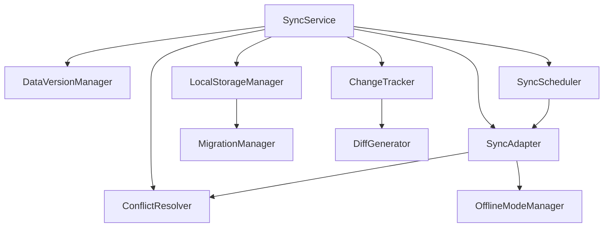

# A4-数据同步框架2.0 - 索引文档(业务能力版)

> **创建时间**: 2025-04-08 23:16:12
> **创建者**: Claude-3.7-Sonnet
> **文档分类**: 项目索引文档
> **强制性声明**: 本文档为A4-数据同步框架2.0版本的入口文档，基于业务能力重新组织任务划分，优化并行开发流程。

## ⚠️ 严格执行声明

本项目已多次延期，资方不再接受任何借口。执行过程必须严格遵循以下铁律：

1. **零容忍策略**: 对任何类型的质量妥协零容忍，宁可延期也不降低标准
2. **全量测试**: 所有组件必须在所有场景下100%通过测试，无一例外
3. **全链路监控**: 每个组件的所有行为必须可监控、可回溯、可诊断
4. **工业级标准**: 代码质量、性能指标必须达到航天级标准(99.9999%)
5. **完整文档**: 所有API和实现细节必须有详尽且无歧义的文档

## 🔍 执行流程优化

为提高并行开发效率，每个业务能力组的开发流程如下：

1. **接口契约设计**: 首先设计并发布接口契约，确保接口稳定性
2. **桩模块实现**: 提供基本功能实现，满足依赖需求
3. **测试套件开发**: 创建覆盖所有功能点的测试套件
4. **功能实现**: 在确保测试通过的前提下完成全部功能
5. **性能优化**: 执行性能基准测试并优化至超越标准
6. **文档完善**: 生成完整API文档和使用指南
7. **交付记录**: 创建完整交付记录，供后续会话参考

## 📊 业务能力分组与任务表

基于业务能力垂直切分，将项目划分为四个主要能力组：

### A4.1 核心同步框架组

| 任务ID | 组件名称 | 优先级 | 开发时间 | 测试覆盖率 | 状态 |
|-------|---------|-------|---------|-------------|------|
| A4.1.1 | SyncService | 最高 | 3小时 | 100% | ⬜ 待开始 |
| A4.1.2 | SyncAdapter | 最高 | 2小时 | 100% | ⬜ 待开始 |
| A4.1.3 | SyncScheduler | 高 | 2小时 | 100% | ⬜ 待开始 |
| A4.1.4 | 框架集成测试 | 高 | 1小时 | 100% | ⬜ 待开始 |

**业务能力**: 
- 同步任务调度与管理
- 同步协议适配
- 对外统一API提供

**开发顺序**:
1. 接口契约设计
2. SyncAdapter桩实现
3. SyncService核心实现
4. SyncScheduler实现
5. 组件集成与测试

### A4.2 数据管理组

| 任务ID | 组件名称 | 优先级 | 开发时间 | 测试覆盖率 | 状态 |
|-------|---------|-------|---------|-------------|------|
| A4.2.1 | LocalStorageManager | 高 | 2.5小时 | 100% | ⬜ 待开始 |
| A4.2.2 | ChangeTracker | 高 | 2小时 | 100% | ⬜ 待开始 |
| A4.2.3 | DiffGenerator | 中 | 2小时 | 100% | ⬜ 待开始 |
| A4.2.4 | 数据管理集成测试 | 中 | 1小时 | 100% | ⬜ 待开始 |

**业务能力**:
- 本地数据CRUD操作
- 数据变更检测与跟踪
- 差量数据生成

**开发顺序**:
1. 接口契约设计
2. LocalStorageManager实现
3. ChangeTracker实现 
4. DiffGenerator实现
5. 组件集成与测试

### A4.3 冲突解决组

| 任务ID | 组件名称 | 优先级 | 开发时间 | 测试覆盖率 | 状态 |
|-------|---------|-------|---------|-------------|------|
| A4.3.1 | ConflictResolver | 高 | 3小时 | 100% | ⬜ 待开始 |
| A4.3.2 | DataVersionManager | 高 | 2小时 | 100% | ⬜ 待开始 |
| A4.3.3 | 冲突解决集成测试 | 中 | 1小时 | 100% | ⬜ 待开始 |

**业务能力**:
- 数据冲突检测
- 冲突解决策略实现
- 版本管理与比较

**开发顺序**:
1. 接口契约设计
2. DataVersionManager实现
3. ConflictResolver基础实现
4. ConflictResolver高级策略实现
5. 组件集成与测试

### A4.4 高级功能组

| 任务ID | 组件名称 | 优先级 | 开发时间 | 测试覆盖率 | 状态 |
|-------|---------|-------|---------|-------------|------|
| A4.4.1 | MigrationManager | 中 | 2.5小时 | 100% | ⬜ 待开始 |
| A4.4.2 | OfflineModeManager | 中 | 2.5小时 | 100% | ⬜ 待开始 |
| A4.4.3 | 高级功能集成测试 | 低 | 1小时 | 100% | ⬜ 待开始 |

**业务能力**:
- 数据模式迁移
- 离线操作支持
- 离线恢复管理

**开发顺序**:
1. 接口契约设计
2. OfflineModeManager实现
3. MigrationManager实现
4. 组件集成与测试

## 📑 接口契约文档清单

以下接口契约文档定义了各业务能力组件间的交互标准，必须优先开发和发布：

| 文档路径 | 状态 | 优先级 | 负责会话 |
|---------|------|-------|---------|
| `/标准/核心同步框架接口契约.md` | ⬜ 待创建 | 最高 | 会话A |
| `/标准/数据管理接口契约.md` | ⬜ 待创建 | 最高 | 会话B |
| `/标准/冲突解决接口契约.md` | ⬜ 待创建 | 最高 | 会话C |
| `/标准/高级功能接口契约.md` | ⬜ 待创建 | 高 | 会话D |

## 📚 强制加载文档清单

所有标记为🔑的文档必须完整加载和理解，不得跳过任何部分：

### 核心文档(会话必读)

| 文档类型 | 文件路径 | 重要程度 | 加载时机 |
|---------|---------|---------|---------|
| 🔑 索引文档 | [索引-业务能力版.md](索引-业务能力版.md) | 最高 | **每次会话开始** |
| 🔑 AI防失忆系统索引 | [AI防失忆/索引.md](AI防失忆/索引.md) | 最高 | **每次会话开始** |
| 🔑 项目概览 | [AI防失忆/项目概览.md](AI防失忆/项目概览.md) | 最高 | **每次会话开始** |
| 🔑 待办事项 | [AI防失忆/待办事项.md](AI防失忆/待办事项.md) | 最高 | **任务开始时** |
| 🔑 业务能力划分指南 | [文档/业务能力划分指南.md](文档/业务能力划分指南.md) | 最高 | **任务开始时** |
| 🔑 开发标准 | [开发标准.md](开发标准.md) | 最高 | **任务开始时** |
| 🔑 全局架构设计 | [架构/全局架构设计.md](架构/全局架构设计.md) | 最高 | **任务开始时** |
| 🔑 当前组接口契约 | [标准/对应接口契约.md] | 最高 | **任务开始时** |
| 🔑 决策记录 | [AI防失忆/决策记录.md](AI防失忆/决策记录.md) | 高 | 涉及重要决策时 |

### 业务能力组特定文档

#### A4.1 核心同步框架组必读

| 文档类型 | 文件路径 | 重要程度 | 加载时机 |
|---------|---------|---------|---------|
| 🔑 核心同步框架接口契约 | [标准/核心同步框架接口契约.md] | 最高 | 开发前必读 |
| 📘 数据同步策略接口 | [标准/数据同步策略接口.md](标准/数据同步策略接口.md) | 高 | 开发前必读 |
| 📘 监控规范 | [标准/监控规范.md](标准/监控规范.md) | 高 | 开发前必读 |

#### A4.2 数据管理组必读

| 文档类型 | 文件路径 | 重要程度 | 加载时机 |
|---------|---------|---------|---------|
| 🔑 数据管理接口契约 | [标准/数据管理接口契约.md] | 最高 | 开发前必读 |
| 📘 性能标准 | [标准/性能标准.md](标准/性能标准.md) | 高 | 开发前必读 |
| 📘 存储安全规范 | [标准/安全规范.md](标准/安全规范.md) | 高 | 开发前必读 |

#### A4.3 冲突解决组必读

| 文档类型 | 文件路径 | 重要程度 | 加载时机 |
|---------|---------|---------|---------|
| 🔑 冲突解决接口契约 | [标准/冲突解决接口契约.md] | 最高 | 开发前必读 |
| 📘 冲突解决规范 | [标准/冲突解决规范.md](标准/冲突解决规范.md) | 高 | 开发前必读 |
| 📘 数据一致性规范 | [标准/数据一致性规范.md](标准/数据一致性规范.md) | 高 | 开发前必读 |

#### A4.4 高级功能组必读

| 文档类型 | 文件路径 | 重要程度 | 加载时机 |
|---------|---------|---------|---------|
| 🔑 高级功能接口契约 | [标准/高级功能接口契约.md] | 最高 | 开发前必读 |
| 📘 数据迁移接口 | [标准/数据迁移接口.md](标准/数据迁移接口.md) | 高 | 开发前必读 |
| 📘 离线功能规范 | [标准/离线功能规范.md](标准/离线功能规范.md) | 高 | 开发前必读 |

## 🛠️ 开发工具与测试基础设施

每个业务能力组应建立专用的测试基础设施，确保测试独立性：

| 工具类型 | 文件路径 | 用途 | 使用要求 |
|---------|---------|------|---------|
| ⚙️ Mock工厂 | [工具/mock工厂.js](工具/mock工厂.js) | 创建依赖组件模拟实现 | 必须使用 |
| ⚙️ 契约验证器 | [工具/契约验证器.js](工具/契约验证器.js) | 验证组件实现符合接口契约 | 必须使用 |
| ⚙️ 测试数据生成器 | [工具/测试数据生成器.js](工具/测试数据生成器.js) | 生成测试数据集 | 必须使用 |
| ⚙️ 性能测试工具 | [工具/性能测试工具.js](工具/性能测试工具.js) | 性能基准测试 | 必须使用 |

## 📊 组件依赖关系(维持不变)

组件间依赖关系保持原有分层架构，但开发顺序会基于业务能力组进行调整：



## 🚨 质量门禁(维持不变)

以下门禁指标必须100%满足，任何一项未达标均视为交付失败：

1. **代码质量门禁**
   - ES5语法兼容性检查: 0警告，0错误
   - 代码压缩通过率: 100%无警告
   - 静态代码分析: 0critical，0major问题
   - 代码注释率: 核心方法100%，辅助方法≥80%

2. **测试门禁**
   - 单元测试覆盖率: 100%代码路径
   - 集成测试覆盖率: 100%接口场景
   - 异常测试覆盖率: 100%错误场景
   - 边界测试覆盖率: 100%边界条件

3. **性能门禁**
   - 数据同步响应时间: <100ms
   - 内存占用: 峰值<5MB，稳定<3MB
   - 大数据量同步: 1000条记录<3秒
   - 弱网表现: 2G网络下响应<5秒

4. **可靠性门禁**
   - 故障恢复率: 100%自动恢复
   - 数据一致性: 100%保证
   - 长时间运行: 24小时无性能衰减
   - 离线恢复: 100%数据恢复成功率

## 🔄 会话间知识传递机制

为确保开发连续性和知识共享，每个业务能力组须维护以下文档：

| 文档类型 | 文件路径 | 用途 | 更新要求 |
|---------|---------|------|---------|
| 📝 上下文概要 | [AI防失忆/A4.x/上下文概要.md] | 总结当前进展和关键决策 | 每次会话结束前 |
| 📝 问题记录 | [AI防失忆/A4.x/问题记录.md] | 记录遇到的问题和解决方案 | 遇到问题时实时 |
| 📝 设计决策 | [AI防失忆/A4.x/设计决策.md] | 记录关键设计决策和理由 | 作出决策时 |
| 📝 下一步计划 | [AI防失忆/A4.x/下一步计划.md] | 明确下一会话工作重点 | 每次会话结束前 |

## 📋 任务执行模板

执行任务时，须遵循以下标准化流程，确保一致性和完整性：

```markdown
# A4.x.y [组件名] 开发执行报告

## 1. 接口契约验证
- 接口规范: [是否符合契约]
- 依赖分析: [依赖组件及接口]
- 契约稳定性: [是否存在变更风险]

## 2. 测试套件实现
[测试用例设计与实现]

## 3. 组件实现
[组件代码实现]

## 4. 验证结果
[测试结果与覆盖率]

## 5. 性能测试
[性能指标实际结果]

## 6. 接口文档
[组件API文档]

## 7. 下一步工作
[后续开发建议]
```

## 📈 项目整体进度评估

截至当前，项目整体完成情况如下：

**整体完成度**: 5%

| 进度类别 | 完成比例 | 说明 |
|---------|---------|------|
| 业务能力组接口契约 | 0/4 (0%) | 尚未开始接口契约设计 |
| 组件实现 | 2/10 (20%) | 已完成DocIndexer和TimestampManager |
| 文档完成 | 3/20 (15%) | 已完成索引文档、业务能力划分和部分标准 |
| 测试覆盖 | 1/10 (10%) | 已开始部分测试设计 |
| A4.1核心同步框架组 | 0% | 尚未开始 |
| A4.2数据管理组 | 0% | 尚未开始 |
| A4.3冲突解决组 | 15% | 已有ConflictResolver基础实现 |
| A4.4高级功能组 | 0% | 尚未开始 |

## 📚 文档更新记录

| 更新日期 | 更新内容 | 更新人 |
|---------|---------|-------|
| 2025-04-08 23:16:12 | 创建业务能力版索引文档 | Claude-3.7-Sonnet |
| 2025-04-08 | 添加业务能力划分指南 | Claude-3.7-Sonnet |
</rewritten_file> 