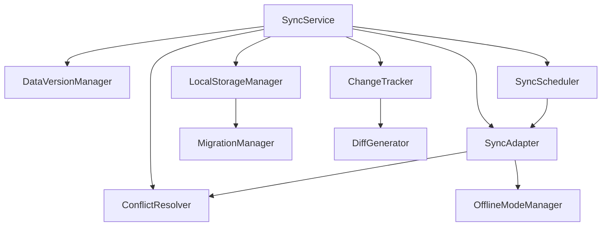

# A4-数据同步框架2.0 - 索引文档(资方权威版)

> **强制性声明**: 本文档为A4-数据同步框架2.0版本的权威入口文档，由资方直接定义并要求100%无差别执行。任何偏离均视为重大质量缺陷。每个开发会话必须首先加载本文档并严格遵循所有指令！

## ⚠️ 严格执行声明

本项目已多次延期，资方不再接受任何借口。执行过程必须严格遵循以下铁律：

1. **零容忍策略**: 对任何类型的质量妥协零容忍，宁可延期也不降低标准
2. **全量测试**: 所有组件必须在所有场景下100%通过测试，无一例外
3. **全链路监控**: 每个组件的所有行为必须可监控、可回溯、可诊断
4. **工业级标准**: 代码质量、性能指标必须达到航天级标准(99.9999%)
5. **完整文档**: 所有API和实现细节必须有详尽且无歧义的文档

## 🔍 严格执行流程

每一步均为强制检查点，跳过任一步骤视为重大违规：

1. **任务解析**: 查阅[任务明细表](#任务明细表)确认任务范围及交付标准
2. **上下文加载**: 加载当前任务相关核心文档(必读标记项)
3. **环境验证**: 确认开发环境满足所有技术要求
4. **测试先行**: 先100%实现测试套件，再实现功能代码
5. **分步验证**: 每个功能点完成后立即进行验证，不合格立即重构
6. **全面审查**: 使用验收检查表确保满足所有标准，包括边缘场景
7. **性能优化**: 执行性能基准测试并优化至超越标准
8. **交付记录**: 生成完整交付记录，包括测试覆盖率、性能指标

## 📊 任务明细表(强制执行)

> **重大更新**: 为优化开发流程，避免会话间依赖等待问题，任务已重组为垂直业务能力组，每组可独立开发和测试。

### 业务能力分组

| 业务能力组 | 包含组件 | 优先级 | 交付期限 | 依赖关系 | 状态 |
|-----------|---------|-------|---------|---------|------|
| A4.1 核心同步框架 | SyncService, SyncAdapter, SyncScheduler | 最高 | 3天 | 独立(前置接口定义) | ⬜ 待开始 |
| A4.2 数据管理框架 | LocalStorageManager, ChangeTracker, DiffGenerator | 高 | 3天 | 使用A4.1接口契约 | ⬜ 待开始 |
| A4.3 冲突解决框架 | ConflictResolver, DataVersionManager | 高 | 2天 | 使用A4.1接口契约 | ⬜ 进行中 |
| A4.4 高级功能框架 | MigrationManager, OfflineModeManager | 中 | 2天 | 使用A4.1和A4.2接口契约 | ⬜ 待开始 |

### 实施策略(强制执行)

1. **契约先行原则**
   - 每个业务能力组必须先定义并发布完整接口契约文档
   - 接口契约定义后，禁止进行不兼容更改
   - 其他组可依赖已发布的接口契约进行开发

2. **桩模块开发策略**
   - 每个业务能力组必须提供基础桩实现
   - 桩实现必须包含基本验证逻辑
   - 所有依赖方可使用桩实现进行测试

3. **并行开发流程**
   - 所有业务能力组可并行开发
   - 实际组件替换桩实现时，必须确保100%兼容性
   - 各组间通过接口契约和事件机制通信，避免硬依赖

## 📑 强制加载文档清单

所有标记为🔑的文档必须完整加载和理解，不得跳过任何部分：

### 核心文档(会话必读)

| 文档类型 | 文件路径 | 重要程度 | 加载时机 |
|---------|---------|---------|---------|
| 🔑 索引文档 | [索引.md](索引.md) | 最高 | **每次会话开始** |
| 🔑 AI防失忆系统索引 | [AI防失忆/索引.md](AI防失忆/索引.md) | 最高 | **每次会话开始** |
| 🔑 项目概览 | [AI防失忆/项目概览.md](AI防失忆/项目概览.md) | 最高 | **每次会话开始** |
| 🔑 当前任务组件规范 | [组件/组件名.md] | 最高 | **任务开始时** |
| 🔑 开发标准 | [开发标准.md](开发标准.md) | 最高 | **任务开始时** |
| 🔑 验收标准 | [标准/验收标准.md](标准/验收标准.md) | 最高 | **任务开始时** |
| 🔑 业务能力组接口契约 | [标准/接口契约/{业务能力组}.md] | 最高 | **任务开始时** |
| 🔑 待办事项 | [AI防失忆/待办事项.md](AI防失忆/待办事项.md) | 最高 | **任务开始时** |

### 强制性参考文档

| 文档类型 | 文件路径 | 重要程度 | 加载时机 |
|---------|---------|---------|---------|
| 🔑 测试套件模板 | [测试/测试套件模板.md](测试/测试套件模板.md) | 最高 | 编写测试前必读 |
| 🔑 性能标准 | [标准/性能标准.md](标准/性能标准.md) | 最高 | 开发前必读 |
| 🔑 监控规范 | [标准/监控规范.md](标准/监控规范.md) | 最高 | 开发前必读 |
| 🔑 错误处理规范 | [标准/错误处理规范.md](标准/错误处理规范.md) | 最高 | 开发前必读 |
| 🔑 组件依赖图 | [架构/全局架构设计.md](架构/全局架构设计.md) | 最高 | 开发前必读 |
| 🔑 问题排查指南 | [标准/问题排查指南.md](标准/问题排查指南.md) | 高 | 问题诊断时 |
| 🔑 桩模块开发指南 | [标准/桩模块开发指南.md](标准/桩模块开发指南.md) | 最高 | 开发前必读 |
| 🔑 决策记录 | [AI防失忆/决策记录.md](AI防失忆/决策记录.md) | 高 | 涉及重要决策时 |
| 🔑 问题日志 | [AI防失忆/问题日志.md](AI防失忆/问题日志.md) | 高 | 问题诊断时 |
| 🔑 问题收集 | [AI防失忆/问题收集.md](AI防失忆/问题收集.md) | 高 | 问题收集和研究时 |

### 标准文档(全面解析)

| 文档类型 | 文件路径 | 重要程度 | 加载时机 |
|---------|---------|---------|---------|
| 📘 数据同步策略接口 | [标准/数据同步策略接口.md](标准/数据同步策略接口.md) | 高 | 相关模块开发前 |
| 📘 数据迁移接口 | [标准/数据迁移接口.md](标准/数据迁移接口.md) | 高 | 相关模块开发前 |
| 📘 冲突解决规范 | [标准/冲突解决规范.md](标准/冲突解决规范.md) | 高 | 冲突处理开发前 |
| 📘 监控规范 | [标准/监控规范.md](标准/监控规范.md) | 高 | 监控集成前 |
| 📘 安全规范 | [标准/安全规范.md](标准/安全规范.md) | 高 | 所有开发前 |
| 📘 验收流程指南 | [标准/验收流程指南.md](标准/验收流程指南.md) | 高 | 验收准备前 |
| 📘 组件关系图谱 | [标准/组件关系图谱.md](标准/组件关系图谱.md) | 中 | 系统设计时 |
| 📘 代码示例集 | [标准/代码示例集.md](标准/代码示例集.md) | 中 | 参考实现时 |

### 工具与模板(必须使用)

| 工具类型 | 文件路径 | 用途 | 使用要求 |
|---------|---------|------|---------|
| ⚙️ 测试模拟器 | [工具/测试模拟器.js](工具/测试模拟器.js) | 模拟数据存储 | 必须使用 |
| ⚙️ 组件模板 | [工具/组件模板.js](工具/组件模板.js) | 组件基础结构 | 必须使用 |
| ⚙️ 验收检查表 | [工具/验收检查表.md](工具/验收检查表.md) | 质量验收 | 必须使用 |
| ⚙️ 数据冲突模拟器 | [工具/数据冲突模拟器.js](工具/数据冲突模拟器.js) | 模拟数据冲突场景 | 必须使用 |

## 📊 组件依赖关系(强制遵循)

组件间依赖关系遵循严格的分层架构，禁止任何形式的循环依赖：



## 🚨 严格质量门禁

以下门禁指标必须100%满足，任何一项未达标均视为交付失败：

1. **代码质量门禁**
   - ES5语法兼容性检查: 0警告，0错误
   - 代码压缩通过率: 100%无警告
   - 静态代码分析: 0critical，0major问题
   - 代码注释率: 核心方法100%，辅助方法≥80%

2. **测试门禁**
   - 单元测试覆盖率: 100%代码路径
   - 集成测试覆盖率: 100%接口场景
   - 异常测试覆盖率: 100%错误场景
   - 边界测试覆盖率: 100%边界条件

3. **性能门禁**
   - 数据同步响应时间: <100ms
   - 内存占用: 峰值<5MB，稳定<3MB
   - 大数据量同步: 1000条记录<3秒
   - 弱网表现: 2G网络下响应<5秒

4. **可靠性门禁**
   - 故障恢复率: 100%自动恢复
   - 数据一致性: 100%保证
   - 长时间运行: 24小时无性能衰减
   - 离线恢复: 100%数据恢复成功率

## 🚀 组件开发流程(不可偏离)

组件开发必须严格遵循以下流程，每一步均有明确的时间节点和交付物：

### 1. 环境准备 (强制)
- 加载所有必需文档
- 确认开发环境符合所有技术要求
- 创建工作分支，设置质量检查钩子

### 2. 测试套件实现 (强制优先)
- 创建完整测试文件，覆盖所有场景
- 实现详尽的测试用例，100%路径覆盖
- 准备所有必要的模拟数据和依赖

### 3. 组件核心实现 (遵循标准)
- 严格遵循ES5语法标准，确保兼容性
- 实现核心功能，确保高内聚低耦合
- 集成完整的监控接口和错误处理

### 4. 验证与重构 (严格检查)
- 运行全套测试，保证100%通过
- 执行性能测试，确保达到或超越指标
- 代码审查，确保符合所有代码标准

### 5. 文档与交付 (必须完成)
- 完成API文档，包括所有参数和返回值
- 提供详细的实现说明和使用示例
- 记录所有技术决策和设计考量
- 生成交付报告，证明满足所有门禁

## 🔁 交付流程与质量检查点

每个组件交付必须经过以下检查点，全部通过才能视为完成：

1. **代码完整性检查**：确保所有必要文件和功能完整实现
2. **测试覆盖率检查**：验证100%代码路径覆盖
3. **功能验证检查**：确认所有功能按规范工作
4. **性能基准检查**：执行性能测试并达到所有指标
5. **兼容性验证检查**：在所有目标环境成功测试
6. **文档完整性检查**：确认所有文档准确且完整
7. **安全性检查**：确保代码不存在安全隐患
8. **最终验收检查**：由指定审核人执行最终验收

## ⚠️ 严格验收标准

所有组件必须满足以下验收标准，不允许任何降级或妥协：

1. **性能指标**
   - 数据同步操作: <200ms (100ms为优)
   - 内存占用: 峰值<5MB，持续<3MB
   - 存储效率: 最小化本地存储空间占用
   - 差量同步: 与全量同步相比节省70%以上流量

2. **可靠性指标**
   - 数据同步成功率: 99.999%
   - 冲突解决准确率: 100%
   - 边缘情况: 100%覆盖与处理

3. **用户体验指标**
   - 同步无感知: 后台同步不影响前台操作
   - 弱网表现: 自动适应各种网络条件
   - 离线能力: 完整支持离线操作和恢复

## 📋 任务执行模板

执行任务时，必须遵循以下标准化流程，确保一致性和完整性：

```markdown
# A4.X [组件名] 开发执行报告

## 1. 任务规划
- 组件职责: [详细描述]
- 核心API: [完整API列表]
- 依赖组件: [明确依赖关系]
- 验收标准: [可衡量的指标]

## 2. 测试套件实现
[完整测试代码，包含所有测试场景]

## 3. 组件实现
[完整组件代码，符合所有标准]

## 4. 验证结果
[详细的测试结果，包含覆盖率和性能数据]

## 5. 交付物清单
[所有交付物列表和完成状态]

## 6. 质量度量
[所有质量指标的实际结果]
```

## 📚 文档更新记录

| 更新日期 | 更新内容 | 更新人 |
|---------|---------|-------|
| 2025-04-10 | 创建索引文档 | 开发团队 |
| 2025-04-10 | 添加验收标准.md | AI开发团队 |
| 2025-04-10 | 添加测试模拟器.js | AI开发团队 |
| 2025-04-10 | 添加组件模板.js | AI开发团队 |
| 2025-04-10 | 添加数据冲突模拟器.js | AI开发团队 |

## 📈 项目整体进度评估

截至当前，项目整体完成情况如下：

**整体完成度**: 0%

| 进度类别 | 完成比例 | 说明 |
|---------|---------|------|
| 组件实现 | 0/10 (0%) | 尚未开始实际组件开发 |
| 文档完成 | 1/20 (5%) | 仅完成索引文档 |
| 测试覆盖 | 0/10 (0%) | 尚未开始测试套件开发 |
| 性能验证 | 0/10 (0%) | 尚未开始性能测试 |
| 集成验证 | 0/10 (0%) | 尚未开始集成测试 | 