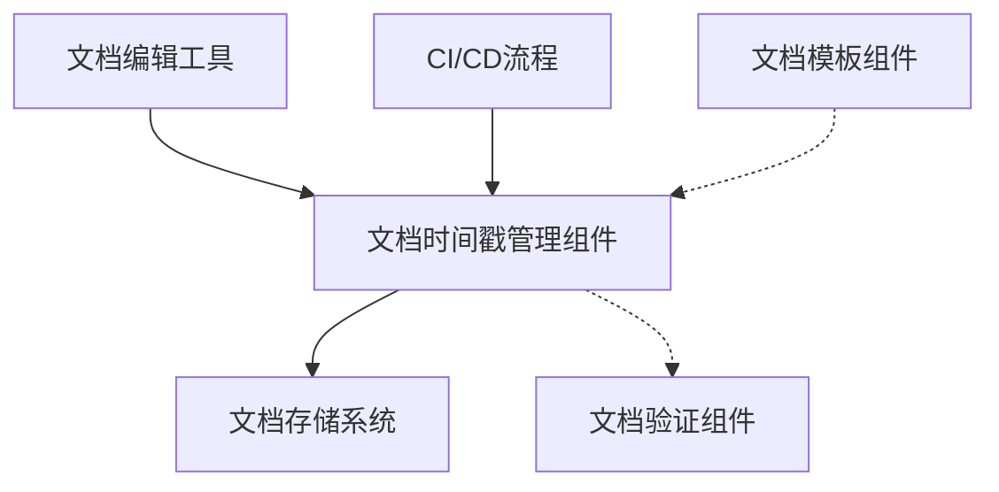
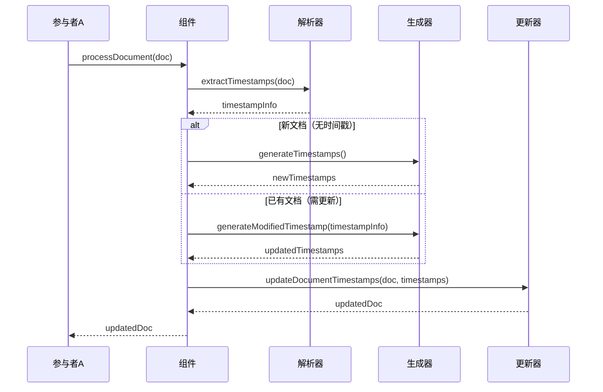

# A4.12 文档时间戳管理组件 - 设计与实现

> **创建时间**: 2025-04-08 22:27:32
> **创建者**: Claude-3.7-Sonnet
> **最后修改**: 2025-04-08 22:27:32
> **文档类型**: 组件设计文档

## 文档概述

本文档详细描述了文档时间戳管理组件的设计、实现和使用方法。该组件负责自动为文档添加创建时间和修改时间戳，确保文档的时间信息准确可靠，是A4-数据同步框架2.0文档子系统中的重要基础设施组件。文档内容包括架构设计、API参考、实现细节、测试策略以及使用示例。

## 内部索引
- [背景与目标](#背景与目标)
- [架构设计](#架构设计)
- [API设计](#api设计)
- [实现细节](#实现细节)
- [测试策略](#测试策略)
- [使用示例](#使用示例)
- [性能指标](#性能指标)
- [问题与解决方案](#问题与解决方案)
- [未来计划](#未来计划)
- [修订历史](#修订历史)

## 背景与目标

### 背景

在大型技术文档项目中，跟踪文档的创建时间和最后修改时间对于文档管理、版本控制和内容审计至关重要。手动维护这些时间戳既耗时又容易出错，特别是在多人协作环境中。

A4-数据同步框架2.0项目中的所有文档都需要遵循严格的文档标准，其中要求每个文档必须包含准确的创建时间和最后修改时间信息。为了确保这些时间信息的准确性和一致性，同时减轻文档维护的负担，我们需要一个自动化的时间戳管理组件。

### 目标

1. 自动为新创建的文档添加创建时间戳和作者信息
2. 在文档修改时自动更新最后修改时间戳
3. 保持时间戳格式的一致性和准确性
4. 提供简单易用的API，可集成到文档编辑工具或CI/CD流程中
5. 智能识别有效修改，避免因微小变更而频繁更新时间戳
6. 支持文档修改历史记录（可选功能）

### 非目标

1. 不替代完整的版本控制系统
2. 不负责文档内容的版本比较
3. 不负责文档权限控制
4. 不处理非文本格式文档的时间戳

## 架构设计

### 整体架构

文档时间戳管理组件在整个文档系统中的位置如下：



### 内部结构

组件内部由以下几个模块组成：

1. **时间戳解析器模块**：负责从文档中解析现有的时间戳信息
2. **时间戳生成模块**：负责生成符合格式的时间戳
3. **文档更新模块**：负责在文档中找到时间戳位置并更新
4. **配置管理模块**：管理时间戳格式和其他配置选项
5. **历史记录模块**：管理文档修改历史（可选功能）
6. **错误处理模块**：处理时间戳处理过程中的各种异常情况

### 核心流程

文档时间戳管理的核心流程如下：



## API设计

### 公开接口

#### processDocument

```javascript
/**
 * 处理文档时间戳，新文档添加创建时间，现有文档更新修改时间
 * @param {string} docContent - 文档内容
 * @param {Object} options - 配置选项
 * @param {string} options.author - 作者名称，默认为系统用户名
 * @param {boolean} options.forceUpdate - 是否强制更新修改时间，默认为false
 * @returns {string} 更新后的文档内容
 * @throws {TimestampError} 时间戳处理错误
 */
function processDocument(docContent, options) {
  // 实现逻辑
}
```

#### extractTimestamps

```javascript
/**
 * 从文档中解析时间戳信息
 * @param {string} docContent - 文档内容
 * @returns {Object} 时间戳信息对象，包含创建时间、修改时间、作者等
 * @throws {ParseError} 解析错误
 */
function extractTimestamps(docContent) {
  // 实现逻辑
}
```

#### generateTimestamps

```javascript
/**
 * 生成新文档所需的完整时间戳信息
 * @param {Object} options - 配置选项
 * @param {string} options.author - 作者名称
 * @returns {Object} 时间戳信息对象
 */
function generateTimestamps(options) {
  // 实现逻辑
}
```

#### updateDocumentTimestamps

```javascript
/**
 * 在文档中更新时间戳信息
 * @param {string} docContent - 文档内容
 * @param {Object} timestamps - 时间戳信息对象
 * @returns {string} 更新后的文档内容
 */
function updateDocumentTimestamps(docContent, timestamps) {
  // 实现逻辑
}
```

### 事件

| 事件名称 | 触发条件 | 事件数据 | 使用场景 |
|---------|----------|---------|----------|
| onTimestampsUpdated | 时间戳更新完成 | {docPath, oldTimestamps, newTimestamps} | 用于记录或通知时间戳更新 |
| onError | 出现错误 | {error, docPath} | 用于错误报告和处理 |

### 配置选项

| 选项名称 | 类型 | 默认值 | 说明 |
|---------|------|-------|------|
| dateFormat | string | "YYYY-MM-DD HH:mm:ss" | 日期时间格式 |
| timestampHeader | string | "创建时间" | 创建时间的标题 |
| modifiedHeader | string | "最后修改" | 修改时间的标题 |
| authorHeader | string | "创建者" | 作者信息的标题 |
| historyEnabled | boolean | false | 是否启用历史记录功能 |
| minChangeInterval | number | 60 | 最小更新间隔（秒） |

## 实现细节

### 数据结构

时间戳信息对象的数据结构：

```javascript
// 时间戳信息对象
var timestampInfo = {
  created: "2025-04-08 22:27:32", // 创建时间
  modified: "2025-04-08 22:27:32", // 最后修改时间
  author: "Claude-3.7-Sonnet", // 作者
  history: [
    {
      time: "2025-04-08 22:27:32",
      author: "Claude-3.7-Sonnet",
      type: "created" // created 或 modified
    }
  ] // 历史记录（可选）
};
```

### 核心算法

1. **时间戳解析算法**：
   - 使用正则表达式匹配Markdown文档头部的时间戳信息
   - 解析时间格式，转换为标准时间对象
   - 处理各种格式变体，确保兼容性

2. **时间戳更新判定算法**：
   - 比较文档内容的有效变化（忽略空白变更）
   - 检查距离上次修改的时间间隔
   - 根据配置决定是否需要更新修改时间

3. **文档更新算法**：
   - 在文档中定位时间戳区域
   - 替换为新生成的时间戳信息
   - 如果是新文档，在适当位置插入时间戳区域

### 性能优化

1. **解析优化**：
   - 只解析文档头部，不处理全文
   - 使用高效的正则表达式匹配

2. **更新优化**：
   - 只在真正需要时更新修改时间，避免频繁更新
   - 缓存解析结果，减少重复解析

### 错误处理

| 错误码 | 错误描述 | 处理方式 |
|-------|---------|---------|
| E101 | 时间戳格式不正确 | 尝试修正格式，记录警告 |
| E102 | 缺少必要的时间戳字段 | 补充缺失字段，记录警告 |
| E103 | 时间戳位置无法确定 | 使用默认位置（文档开头），记录警告 |
| E104 | 时间戳更新失败 | 返回原文档，记录错误 |

## 测试策略

### 单元测试

1. **解析器测试**：
   - 测试各种格式时间戳的解析
   - 测试非标准格式的兼容性
   - 测试缺失字段的处理

2. **生成器测试**：
   - 测试不同配置下的时间戳生成
   - 测试日期格式的正确性
   - 测试历史记录功能

3. **更新器测试**：
   - 测试时间戳位置查找
   - 测试时间戳替换功能
   - 测试新时间戳插入功能

### 集成测试

1. 测试与文档编辑工具的集成
2. 测试在CI/CD流程中的使用
3. 测试与文档索引组件的协同工作

### 性能测试

1. 测试大批量文档的处理性能
2. 测试频繁更新场景下的性能
3. 测试历史记录功能对性能的影响

## 使用示例

### 基本用法

```javascript
// 引入组件
var timestampManager = require('./timestampManager');

// 读取文档内容
var docContent = readFile('document.md');

// 处理文档时间戳
var updatedDoc = timestampManager.processDocument(docContent, {
  author: 'Claude-3.7-Sonnet'
});

// 保存更新后的文档
writeFile('document.md', updatedDoc);
```

### 高级用法

```javascript
// 自定义配置
var options = {
  dateFormat: "YYYY/MM/DD HH:mm",
  timestampHeader: "Created",
  modifiedHeader: "Last Modified",
  authorHeader: "Author",
  historyEnabled: true,
  minChangeInterval: 300 // 5分钟
};

// 处理文档并强制更新时间戳
var updatedDoc = timestampManager.processDocument(docContent, {
  author: 'Claude-3.7-Sonnet',
  forceUpdate: true,
  ...options
});

// 或者直接解析时间戳信息
var timestamps = timestampManager.extractTimestamps(docContent);
console.log(JSON.stringify(timestamps, null, 2));
```

## 性能指标

| 指标名称 | 预期值 | 测试方法 | 测试环境 |
|---------|-------|---------|---------|
| 处理速度 | <50ms/文档 | 使用标准文档测试 | 标准开发环境 |
| 批处理速度 | <5s/100文档 | 批量处理100个文档 | 标准开发环境 |
| 内存占用 | <20MB | 处理大批量文档监控内存 | 标准开发环境 |

## 问题与解决方案

### 已知问题

1. 非标准格式的时间戳可能无法正确解析
2. 在多人同时编辑同一文档时可能出现冲突
3. 频繁保存可能导致修改时间戳过于频繁更新

### 常见问题解答

1. **Q: 如何避免频繁保存导致的过多时间戳更新？**  
   A: 组件内置了最小更新间隔机制，可通过minChangeInterval配置项调整。默认情况下，只有当距离上次修改超过60秒且文档内容有实质性变化时才会更新修改时间。

2. **Q: 如何处理文档合并时的时间戳冲突？**  
   A: 组件会保留最新的修改时间，并将冲突的修改记录到历史中（如果启用了历史记录功能）。

3. **Q: 是否支持自定义时间戳格式？**  
   A: 是的，可以通过配置选项自定义时间戳的格式、标题和位置。

## 未来计划

1. 添加更丰富的历史记录功能，包括变更摘要
2. 实现文档变更差异分析，智能确定是否需要更新时间戳
3. 添加与版本控制系统的集成
4. 支持团队协作场景下的贡献者追踪

## 修订历史

| 日期 | 版本 | 修改内容 | 修改人 |
|------|------|---------|-------|
| 2025-04-08 | 1.0 | 初始版本 | Claude-3.7-Sonnet | 