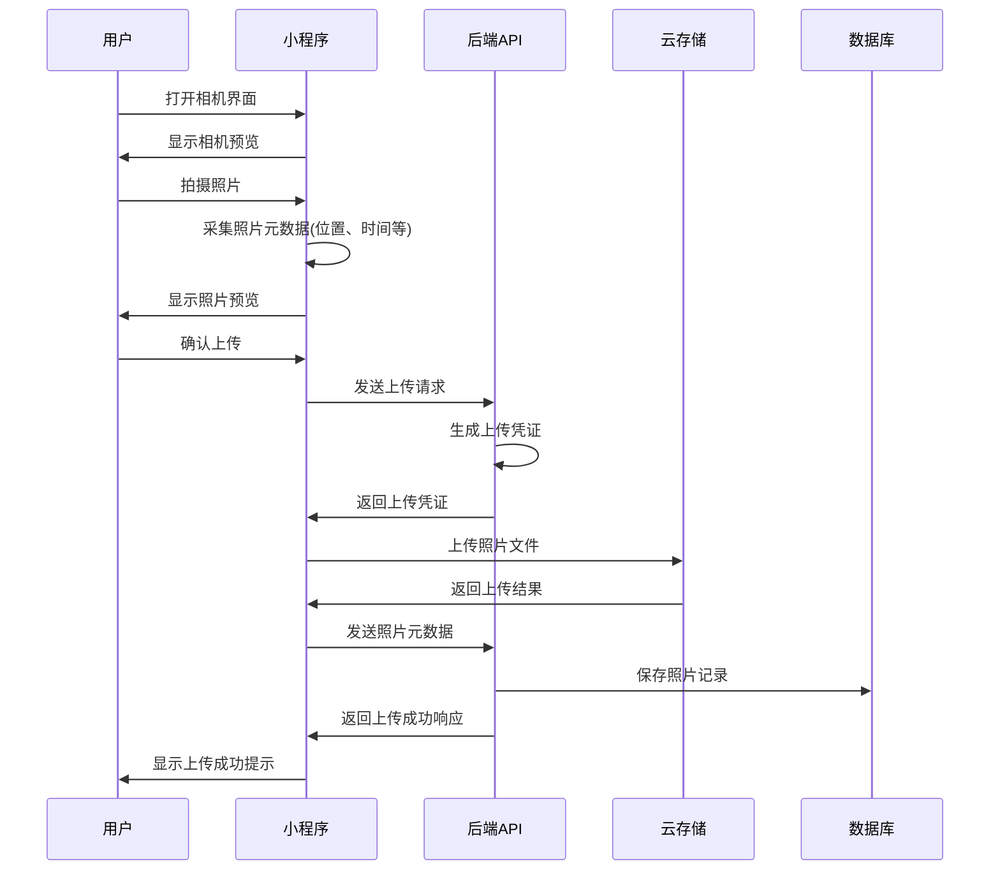
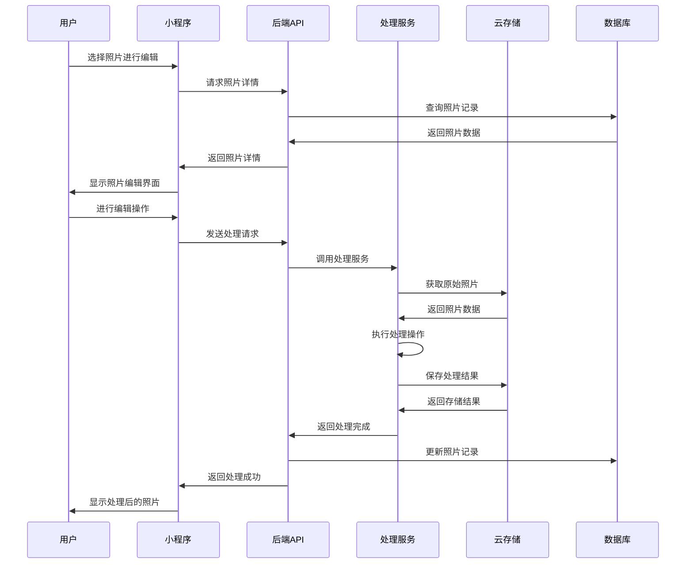

# 照片采集与管理模块

> 创建时间：2025-04-10 09:44:16  
> 创建者：系统开发团队  
> 文档状态：初稿  
> 版本号：v1.0

## 目录

1. [模块概述](#模块概述)
2. [核心功能](#核心功能)
3. [详细功能说明](#详细功能说明)
   - [照片采集](#照片采集)
   - [照片管理](#照片管理)
   - [照片处理](#照片处理)
   - [照片分类与标签](#照片分类与标签)
4. [组件设计](#组件设计)
5. [接口规范](#接口规范)
6. [用户界面设计](#用户界面设计)
7. [数据模型](#数据模型)
8. [业务流程](#业务流程)
9. [安全考量](#安全考量)
10. [性能优化](#性能优化)

## 模块概述

照片采集与管理模块是工作留痕系统的核心功能之一，用于支持工作人员现场采集照片证据、管理照片资源并与工作记录关联。该模块提供了完整的照片生命周期管理，包括拍摄、上传、存储、处理、分类、查询和共享等功能，确保工作痕迹的直观性和证据的完整性。

### 设计目标

- 提供便捷高效的照片采集功能，支持多种场景下的快速拍摄
- 实现照片资源的集中管理和精准分类
- 保证照片数据的安全性和完整性
- 优化照片存储和访问性能
- 提供灵活的照片处理和编辑能力

## 核心功能

| 功能分类 | 核心功能 | 优先级 | 技术实现 |
|---------|---------|-------|---------|
| 照片采集 | 相机拍摄 | 高 | 微信小程序相机API |
| | 照片上传 | 高 | 微信上传组件 + 七牛云存储 |
| | 批量导入 | 中 | 文件选择器 + 队列处理 |
| 照片管理 | 照片分类 | 高 | 自定义分类系统 + 标签管理 |
| | 照片搜索 | 高 | ElasticSearch + 图像识别API |
| | 照片关联 | 高 | 关系数据模型 + MongoDB |
| 照片处理 | 照片压缩 | 高 | 七牛云图片处理服务 |
| | 照片编辑 | 中 | Canvas + 图像处理库 |
| | 水印添加 | 高 | 服务端处理 + 七牛云图片处理 |
| 照片共享 | 照片授权 | 中 | 基于角色的访问控制 |
| | 照片导出 | 中 | 格式转换 + 打包下载 |

## 详细功能说明

### 照片采集

#### 相机拍摄

支持用户通过内置相机功能直接拍摄照片，并具备以下特性：

- **模式选择**：支持普通拍摄、连拍、定时拍摄等多种模式
- **参数调节**：支持闪光灯控制、曝光调节、对焦模式等参数设置
- **实时预览**：提供拍摄前的实时画面预览
- **快速重拍**：支持不满意照片的即时重拍
- **地理标记**：自动记录拍摄地点的经纬度信息
- **时间戳**：自动为照片添加精确拍摄时间

```javascript
// 相机拍摄功能核心代码示例
const takePhoto = async function() {
  try {
    const cameraCtx = wx.createCameraContext();
    const photoRes = await cameraCtx.takePhoto({
      quality: 'high',
      success: (res) => {
        // 处理拍摄成功的照片
        const tempImagePath = res.tempImagePath;
        // 获取地理位置信息
        wx.getLocation({
          type: 'gcj02',
          success: (location) => {
            uploadPhoto(tempImagePath, {
              latitude: location.latitude,
              longitude: location.longitude,
              timestamp: new Date().getTime()
            });
          }
        });
      }
    });
  } catch (error) {
    console.error('拍照失败：', error);
  }
};
```

#### 照片上传

提供多种照片上传方式，确保在各种网络环境下的可靠传输：

- **即时上传**：拍摄完成后立即上传到云端
- **批量上传**：支持多张照片同时上传
- **断点续传**：网络不稳定情况下支持断点续传
- **后台上传**：支持应用在后台继续完成上传任务
- **压缩上传**：根据网络状况自动调整上传质量
- **上传进度**：实时显示上传进度和状态

```javascript
// 照片上传功能核心代码示例
const uploadPhoto = function(tempFilePath, metadata) {
  const uploadTask = wx.uploadFile({
    url: 'https://api.example.com/upload',
    filePath: tempFilePath,
    name: 'photo',
    formData: {
      'metadata': JSON.stringify(metadata)
    },
    header: {
      'content-type': 'multipart/form-data',
      'Authorization': `Bearer ${getToken()}`
    },
    success(res) {
      const data = JSON.parse(res.data);
      if (data.success) {
        // 上传成功处理
        savePhotoRecord(data.fileId, metadata);
      }
    },
    fail(err) {
      // 添加到失败队列，稍后重试
      addToRetryQueue({tempFilePath, metadata});
    }
  });
  
  uploadTask.onProgressUpdate((res) => {
    // 更新上传进度UI
    updateProgressUI(res.progress);
  });
};
```

### 照片管理

#### 照片组织

实现灵活高效的照片组织系统：

- **多级分类**：支持按项目、任务、日期等多维度分类
- **智能分组**：基于时间、地点、内容智能分组照片
- **标签系统**：支持为照片添加自定义标签
- **收藏功能**：可将重要照片标记为收藏
- **批量操作**：支持批量选择、移动、删除等操作
- **排序方式**：支持多种排序方式（时间、名称、大小等）

#### 照片搜索

提供强大的照片检索能力：

- **全文搜索**：基于照片名称、描述、标签等进行搜索
- **高级筛选**：支持多条件组合筛选
- **时间范围**：按拍摄时间范围筛选
- **地理位置**：基于地理位置信息检索照片
- **图像识别**：基于图像内容的智能搜索（如识别图中人物、物体等）
- **相似照片**：查找相似内容的照片

### 照片处理

#### 基础处理

提供常用的照片处理功能：

- **裁剪调整**：支持照片裁剪和旋转
- **滤镜效果**：提供多种滤镜供选择
- **亮度对比度**：调整照片亮度、对比度等参数
- **文字注释**：支持在照片上添加文字说明
- **马赛克处理**：对敏感信息进行马赛克处理
- **撤销重做**：支持编辑操作的撤销和重做

#### 水印管理

为保护照片版权和来源，提供水印功能：

- **自动水印**：上传照片时自动添加水印
- **水印模板**：支持多种水印模板选择
- **自定义水印**：可自定义水印内容、位置、透明度等
- **条件水印**：根据不同使用场景应用不同水印策略

```javascript
// 水印添加功能核心代码
const addWatermark = function(imageUrl, watermarkOptions) {
  // 使用七牛云图片处理API添加水印
  const baseUrl = imageUrl;
  const watermarkText = encodeURIComponent(watermarkOptions.text || '工作留痕系统');
  const fontsize = watermarkOptions.fontSize || 20;
  const opacity = watermarkOptions.opacity || 50;
  const position = watermarkOptions.position || 'SouthEast';
  
  // 构建带水印的图片URL
  const watermarkedUrl = `${baseUrl}?watermark/2/text/${watermarkText}/font/SimSun/fontsize/${fontsize}/fill/IzM4MzgzOA==/dissolve/${opacity}/gravity/${position}/dx/10/dy/10`;
  
  return watermarkedUrl;
};
```

## 组件设计

### 前端组件

| 组件名称 | 功能描述 | 复用性 | 依赖关系 |
|---------|---------|-------|---------|
| PhotoCamera | 相机拍摄组件 | 高 | 微信相机API |
| PhotoUploader | 照片上传组件 | 高 | 上传管理服务 |
| PhotoViewer | 照片查看组件 | 高 | 图片加载服务 |
| PhotoEditor | 照片编辑组件 | 中 | Canvas, 图像处理库 |
| PhotoGallery | 照片画廊组件 | 高 | PhotoViewer |
| PhotoFilter | 照片筛选组件 | 中 | 搜索服务 |
| PhotoTagManager | 标签管理组件 | 高 | 标签服务 |
| WatermarkTool | 水印工具组件 | 中 | 图像处理服务 |

### 后端服务

| 服务名称 | 功能描述 | 技术实现 | 外部依赖 |
|---------|---------|---------|---------|
| PhotoUploadService | 处理照片上传请求 | Node.js, Express | 七牛云存储 |
| PhotoMetadataService | 管理照片元数据 | MongoDB | 无 |
| PhotoProcessingService | 处理照片格式转换和压缩 | Node.js, Sharp | 七牛云图片处理 |
| PhotoSearchService | 提供照片检索功能 | ElasticSearch | 无 |
| PhotoAuthService | 管理照片访问权限 | JWT, RBAC | 用户服务 |
| GeoTaggingService | 处理地理标记信息 | GeoJSON, MongoDB | 地图服务API |

## 接口规范

### 照片上传接口

```http
POST /api/v1/photos/upload
Content-Type: multipart/form-data
Authorization: Bearer {token}

Form Data:
- file: (binary) 照片文件
- metadata: (JSON) {
    "projectId": "项目ID",
    "taskId": "任务ID",
    "description": "照片描述",
    "tags": ["标签1", "标签2"],
    "location": {
      "latitude": 纬度,
      "longitude": 经度
    },
    "captureTime": "拍摄时间ISO字符串"
  }

响应:
{
  "success": true,
  "data": {
    "photoId": "照片ID",
    "url": "照片访问URL",
    "thumbnailUrl": "缩略图URL",
    "metadata": {
      // 上传时提供的元数据以及系统生成的元数据
    }
  }
}
```

### 照片列表接口

```http
GET /api/v1/photos
Authorization: Bearer {token}
Content-Type: application/json

Query Parameters:
- projectId: 项目ID (可选)
- taskId: 任务ID (可选)
- tags: 标签列表 (可选，逗号分隔)
- startDate: 开始日期 (可选，ISO格式)
- endDate: 结束日期 (可选，ISO格式)
- page: 页码 (默认1)
- pageSize: 每页数量 (默认20)
- sortBy: 排序字段 (默认captureTime)
- sortOrder: 排序方式 (asc或desc，默认desc)

响应:
{
  "success": true,
  "data": {
    "total": 总数量,
    "page": 当前页码,
    "pageSize": 每页数量,
    "photos": [
      {
        "photoId": "照片ID",
        "url": "照片访问URL",
        "thumbnailUrl": "缩略图URL",
        "metadata": {
          // 照片元数据
        },
        "uploadTime": "上传时间",
        "captureTime": "拍摄时间"
      }
      // ...更多照片
    ]
  }
}
```

### 照片详情接口

```http
GET /api/v1/photos/{photoId}
Authorization: Bearer {token}
Content-Type: application/json

响应:
{
  "success": true,
  "data": {
    "photoId": "照片ID",
    "originalUrl": "原始照片URL",
    "processedUrl": "处理后照片URL",
    "thumbnailUrl": "缩略图URL",
    "metadata": {
      "fileName": "文件名",
      "fileSize": 文件大小(bytes),
      "width": 宽度(像素),
      "height": 高度(像素),
      "format": "图片格式",
      "projectId": "项目ID",
      "taskId": "任务ID",
      "description": "照片描述",
      "tags": ["标签1", "标签2"],
      "location": {
        "latitude": 纬度,
        "longitude": 经度,
        "address": "地址文本描述"
      },
      "captureTime": "拍摄时间",
      "device": "拍摄设备信息"
    },
    "uploadTime": "上传时间",
    "uploadedBy": {
      "userId": "用户ID",
      "userName": "用户名"
    },
    "processingHistory": [
      {
        "type": "处理类型",
        "time": "处理时间",
        "operator": "操作人",
        "parameters": {
          // 处理参数
        }
      }
      // ...更多处理记录
    ]
  }
}
```

## 用户界面设计

### 照片采集界面


照片采集界面包括以下关键元素：

1. **相机取景区**：占据主要屏幕空间，显示实时预览
2. **拍摄按钮**：位于底部中央，用于触发拍摄
3. **参数控制栏**：位于底部，包含闪光灯、曝光等快速控制
4. **模式切换器**：位于底部，可切换普通、连拍等模式
5. **预览缩略图**：显示最近拍摄的照片缩略图
6. **项目选择器**：可快速选择关联的项目和任务
7. **位置信息**：显示当前位置信息

### 照片管理界面

照片管理界面采用网格布局，支持多种视图模式：

1. **网格视图**：默认视图，以缩略图网格形式展示照片
2. **列表视图**：以列表形式显示照片及其关键元数据
3. **时间线视图**：按时间轴组织显示照片

界面顶部包含搜索栏和筛选器，左侧为分类导航树，右侧为照片属性面板。

### 照片编辑界面

照片编辑界面分为三个主要区域：

1. **编辑画布**：中央区域，显示当前编辑的照片
2. **工具栏**：顶部，包含各种编辑工具
3. **属性面板**：右侧，显示当前选中工具的属性设置

提供直观的编辑操作和实时预览功能，支持手势操作。

## 数据模型

### Photo 模型

```javascript
const PhotoSchema = new mongoose.Schema({
  // 基本信息
  fileName: { type: String, required: true },
  fileSize: { type: Number, required: true },
  fileType: { type: String, required: true },
  width: { type: Number },
  height: { type: Number },
  
  // 存储信息
  originalKey: { type: String, required: true }, // 原始文件存储键
  thumbnailKey: { type: String }, // 缩略图存储键
  processedKey: { type: String }, // 处理后文件存储键
  
  // 业务关联
  projectId: { type: mongoose.Schema.Types.ObjectId, ref: 'Project', index: true },
  taskId: { type: mongoose.Schema.Types.ObjectId, ref: 'Task', index: true },
  recordId: { type: mongoose.Schema.Types.ObjectId, ref: 'WorkRecord', index: true },
  
  // 拍摄信息
  captureTime: { type: Date, required: true, index: true },
  device: {
    model: { type: String },
    manufacturer: { type: String },
    osVersion: { type: String }
  },
  location: {
    latitude: { type: Number },
    longitude: { type: Number },
    altitude: { type: Number },
    accuracy: { type: Number },
    address: { type: String }
  },
  
  // 内容描述
  description: { type: String },
  tags: [{ type: String, index: true }],
  
  // 权限与状态
  isPublic: { type: Boolean, default: false },
  status: { 
    type: String, 
    enum: ['uploading', 'processing', 'active', 'archived', 'deleted'],
    default: 'active',
    index: true
  },
  
  // 用户信息
  createdBy: { type: mongoose.Schema.Types.ObjectId, ref: 'User', required: true },
  updatedBy: { type: mongoose.Schema.Types.ObjectId, ref: 'User' },
  
  // 时间戳
  createdAt: { type: Date, default: Date.now, index: true },
  updatedAt: { type: Date, default: Date.now }
});

// 索引
PhotoSchema.index({ projectId: 1, createdAt: -1 });
PhotoSchema.index({ taskId: 1, createdAt: -1 });
PhotoSchema.index({ tags: 1 });
PhotoSchema.index({ 'location.latitude': 1, 'location.longitude': 1 });
PhotoSchema.index({ captureTime: 1 });

// 方法
PhotoSchema.methods.generateUrl = function(type = 'original') {
  const baseUrl = 'https://cdn.example.com/';
  switch(type) {
    case 'thumbnail':
      return `${baseUrl}${this.thumbnailKey}`;
    case 'processed':
      return this.processedKey ? `${baseUrl}${this.processedKey}` : null;
    case 'original':
    default:
      return `${baseUrl}${this.originalKey}`;
  }
};

const Photo = mongoose.model('Photo', PhotoSchema);
```

### PhotoAlbum 模型

```javascript
const PhotoAlbumSchema = new mongoose.Schema({
  name: { type: String, required: true },
  description: { type: String },
  coverPhotoId: { type: mongoose.Schema.Types.ObjectId, ref: 'Photo' },
  
  // 关联项目或任务
  projectId: { type: mongoose.Schema.Types.ObjectId, ref: 'Project' },
  taskId: { type: mongoose.Schema.Types.ObjectId, ref: 'Task' },
  
  // 相册类型
  type: { 
    type: String, 
    enum: ['project', 'task', 'custom'], 
    default: 'custom' 
  },
  
  // 包含的照片IDs
  photos: [{ 
    type: mongoose.Schema.Types.ObjectId, 
    ref: 'Photo' 
  }],
  
  // 统计信息
  photoCount: { type: Number, default: 0 },
  
  // 权限设置
  visibility: { 
    type: String, 
    enum: ['private', 'team', 'public'], 
    default: 'private' 
  },
  
  // 用户信息
  createdBy: { type: mongoose.Schema.Types.ObjectId, ref: 'User', required: true },
  updatedBy: { type: mongoose.Schema.Types.ObjectId, ref: 'User' },
  
  // 时间戳
  createdAt: { type: Date, default: Date.now },
  updatedAt: { type: Date, default: Date.now }
});

const PhotoAlbum = mongoose.model('PhotoAlbum', PhotoAlbumSchema);
```

## 业务流程

### 照片采集与上传流程



### 照片处理流程



## 安全考量

### 数据安全

- **存储加密**：照片数据在云端存储时采用AES-256加密
- **传输加密**：所有API通信采用HTTPS协议，确保传输安全
- **访问控制**：基于JWT的用户认证和基于角色的访问控制
- **防盗链**：使用URL签名和有效期防止未授权访问照片

### 隐私保护

- **元数据清洗**：上传前清洗照片中的敏感EXIF信息
- **位置模糊化**：提供位置信息模糊化选项，保护精确位置
- **敏感信息识别**：自动识别并处理照片中的敏感信息（如身份证号）
- **用户授权**：明确获取用户对位置、相机等敏感权限的授权

## 性能优化

### 照片存储优化

- **分层存储**：根据访问频率将照片分配到不同存储层
- **CDN加速**：使用内容分发网络加速照片访问
- **延迟加载**：列表页面采用延迟加载策略
- **预加载**：预测性加载用户可能访问的照片

### 上传优化

- **分块上传**：大文件采用分块上传策略
- **压缩策略**：根据网络状况动态调整压缩比例
- **队列管理**：上传任务队列化，支持后台上传和优先级调度
- **重试机制**：网络异常时自动重试，提高上传成功率

### 查询性能

- **索引优化**：为常用查询字段建立合适的索引
- **查询缓存**：缓存常用查询结果
- **聚合预计算**：预计算并缓存统计数据
- **分页限制**：限制单次查询返回的照片数量 