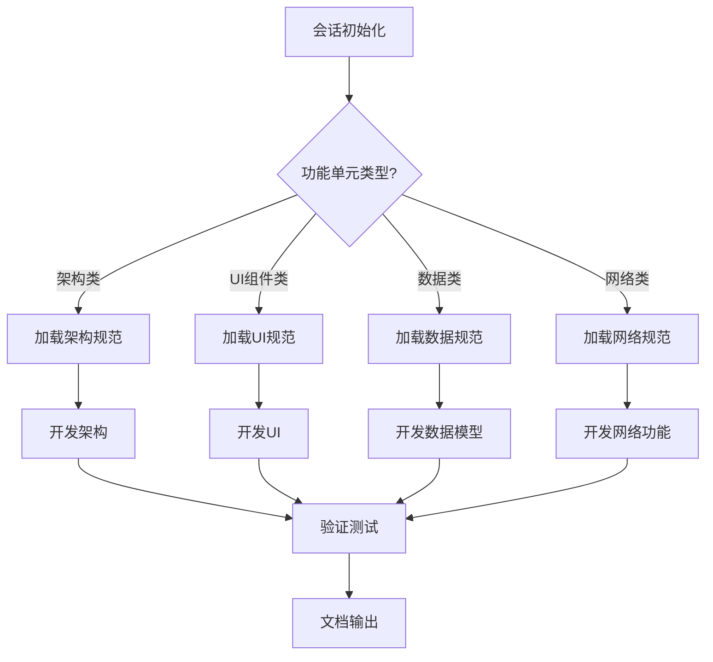

# 工作留痕系统 - 任务入口文档

> **重要更新**: 为了提高AI开发效率，我们已将任务文档结构优化为"按需加载"模式。请使用新的入口文档: [任务入口/00-入口索引.md](任务入口/00-入口索引.md)

## 如何使用新的任务入口

1. 当你收到"请按需阅读入口文档，你当前的工作是'XX'"指令时
2. 直接访问 `任务入口/XX-任务名称.md` 文件
3. 该文件包含完成此任务所需的全部信息，无需阅读其他内容

### 新旧文档对照表

| 旧文档部分 | 新文档位置 |
|---------|---------|
| 快速任务识别表 | [任务入口/00-入口索引.md](任务入口/00-入口索引.md) |
| 功能单元核心知识集 | 各任务文档中的"关键技术要求"部分 |
| 自动化测试框架 | 各任务文档中的"验证测试代码"部分 |
| 开发任务模板 | 各任务文档的完整结构 |
| 命令参考 | 各任务文档中的"开发步骤"部分 |
| 问题速查表 | 各任务文档中的"常见问题与解决方案"部分 |

### 当前已完成的任务文档

- [A1-基础应用架构.md](任务入口/A1-基础应用架构.md)
- [A2-本地存储管理.md](任务入口/A2-本地存储管理.md)

### 按需加载的优势

1. **高效开发**: 每个会话的AI只需阅读与当前任务直接相关的内容
2. **减少上下文占用**: 避免加载大量无关内容占用上下文空间
3. **更丰富的内容**: 每个任务文档可以包含更详细的实现示例和测试代码
4. **专注性提升**: 消除干扰信息，帮助AI更专注于当前任务

---

> 注意: 以下为旧版文档内容，仅作参考，推荐使用新版任务入口文档。

## 1. 快速任务识别表

| 功能单元ID | 功能名称     | 类型   | 核心关注点            | 所需文档              |
| ---------- | ------------ | ------ | --------------------- | --------------------- |
| A1         | 基础应用架构 | 架构   | 目录结构、分包配置    | 小程序规范, 架构参考  |
| A2         | 本地存储管理 | 数据   | Storage封装, 数据清理 | 存储规范, 数据模型    |
| A3         | 网络请求管理 | 网络   | 请求封装, 错误处理    | API接口定义, 网络处理 |
| B1         | 基础照片采集 | UI/API | 相机调用, 图片处理    | 小程序API, UI组件     |
| B2         | 照片编辑标注 | UI     | 图片编辑, 画布操作    | UI组件, Canvas规范    |
| C1         | 文本填写组件 | UI     | 表单设计, 输入验证    | UI组件, 表单规范      |
| D1         | 内容模板管理 | 数据   | 模板结构, 动态加载    | 数据模型, 模板规范    |
| E1         | 留痕类型选择 | UI     | 分类选择, 状态管理    | UI组件, 数据模型      |
| ...        | ...          | ...    | ...                   | ...                   |

## 2. 开发流程快速指引



## 3. 功能单元核心知识集

### A系列：架构与基础设施

**关键规范摘要**：

- 严格遵循小程序目录结构规范
- 所有代码必须符合ES5标准，禁用ES6+特性
- 分包配置必须合理，主包不超过1MB
- 自动解决循环依赖问题，使用事件总线或依赖注入

**架构参考**：基础架构采用分层设计，通过事件机制和依赖注入避免循环引用

```
app/
├── api/ (API调用层)
├── components/ (UI组件层)
├── utils/ (工具层)
├── models/ (数据模型层)
├── pages/ (页面层)
└── services/ (服务层)
```

**循环依赖解决方案**：

1. 引入事件总线：`EventBus.js` 中央事件处理器
2. 依赖注入容器：`ServiceContainer.js` 统一管理服务实例
3. 单向数据流：数据仅通过特定接口流动，禁止双向依赖

### B系列：照片采集与处理

**关键规范摘要**：				

- 使用 `wx.chooseMedia` 或降级方案 `wx.chooseImage`
- 图片必须压缩处理，超过100KB必须优化
- 实现离线图片队列，网络恢复后自动同步
- Canvas操作必须处理不同设备分辨率差异

**性能优化要点**：

- 图片延迟加载
- 列表虚拟化渲染
- 分批处理大量图片

### C系列：文本处理组件

**关键规范摘要**：

- 表单验证必须统一处理，包含前后端双重验证
- 输入框必须防抖处理，避免频繁触发事件
- 长文本必须支持分页和懒加载

### D系列：内容管理

**关键规范摘要**：

- 模板数据与实例数据分离存储
- 动态内容必须支持增量更新
- 大数据量处理必须分批进行，避免阻塞UI线程

### E系列：选择与分类

**关键规范摘要**：

- 分类数据必须支持动态更新和离线使用
- 选择组件必须适配不同屏幕尺寸
- 必须实现默认选项和最近使用功能

## 4. 自动化测试框架

### 单元测试

针对每个功能单元，应创建以下自动化测试：

```javascript
// 示例：存储模块测试用例
function testStorageModule() {
  var testData = {key: 'value', items: [1,2,3]};
  
  // 测试数据存储
  StorageService.save('test_key', testData);
  var retrieved = StorageService.get('test_key');
  console.assert(JSON.stringify(retrieved) === JSON.stringify(testData), 
                '存储数据不匹配');
  
  // 测试存储限制处理
  var largeData = generateLargeData(); // 生成超过限制的数据
  StorageService.save('large_data', largeData);
  // 验证是否正确处理了大数据情况
  console.assert(StorageService.hasError() === false, 
                '大数据处理失败');
              
  console.log('存储模块测试完成');
}

// 运行测试
function runTests() {
  try {
    testStorageModule();
    testNetworkModule();
    // 其他测试...
    console.log('所有测试通过');
  } catch(e) {
    console.error('测试失败:', e);
  }
}
```

### 集成测试

关键流程的集成测试示例：

```javascript
// 照片采集-存储-上传流程测试
function testPhotoCaptureThenUpload() {
  // 模拟照片采集
  mockPhotoCapture(function(imagePath) {
    // 验证图片存储
    var success = StorageService.saveImage(imagePath);
    console.assert(success, '图片存储失败');
  
    // 模拟在线状态
    mockNetworkOnline();
  
    // 触发上传
    UploadService.syncPendingImages();
  
    // 验证上传结果
    setTimeout(function() {
      var status = UploadService.getStatus();
      console.assert(status.pending === 0, '仍有待上传图片');
      console.assert(status.uploaded > 0, '没有上传成功的图片');
    
      console.log('照片流程测试完成');
    }, 1000);
  });
}
```

### 快速验证工具

针对常见问题的快速验证工具：

```javascript
// 循环依赖检测
function checkCircularDependencies() {
  var modules = [
    'app.js', 'utils/storage.js', 'utils/network.js',
    'services/uploadService.js', 'services/dataService.js'
  ];
  
  var dependencies = {};
  var circularFound = false;
  
  // 收集依赖关系
  modules.forEach(function(module) {
    dependencies[module] = getDependencies(module);
  });
  
  // 检测循环
  modules.forEach(function(module) {
    var visited = {};
    if (hasCircular(module, dependencies, visited)) {
      circularFound = true;
      console.error('发现循环依赖，起点:', module);
    }
  });
  
  if (!circularFound) {
    console.log('未发现循环依赖');
  }
  
  return !circularFound;
}

// 模拟函数
function getDependencies(modulePath) {
  // 实际实现应该解析文件内容，提取import/require语句
  // 此处使用模拟数据
  var mockDependencies = {
    'app.js': ['utils/storage.js', 'utils/network.js'],
    'utils/storage.js': [],
    'utils/network.js': ['services/uploadService.js'],
    'services/uploadService.js': ['services/dataService.js'],
    'services/dataService.js': [] // 如果这里引用了app.js就会形成循环
  };
  
  return mockDependencies[modulePath] || [];
}

function hasCircular(module, dependencies, visited) {
  if (visited[module]) return true;
  
  visited[module] = true;
  
  for (var i = 0; i < dependencies[module].length; i++) {
    var dependency = dependencies[module][i];
    if (hasCircular(dependency, dependencies, Object.assign({}, visited))) {
      return true;
    }
  }
  
  return false;
}
```

## 5. 开发任务模板

根据功能单元ID，复制以下对应模板，填充必要内容后开始开发：

### 架构类任务模板 (A系列)

```
会话ID: WXMP-[日期]-[功能ID]
功能单元: [功能ID]-[功能名称]
类型: 架构类

# 开发目标
[简要描述架构目标]

# 关键约束
1. 严格遵循ES5标准
2. 防止循环依赖
3. [其他约束]

# 开发步骤
1. [ ] 创建基础目录结构
2. [ ] 实现核心架构组件
3. [ ] 编写模块单元测试
4. [ ] 运行循环依赖检测
5. [ ] 验证架构设计

# 验证方式
1. 目录结构检查
2. 模块加载测试
3. 循环依赖检测
```

### UI组件类任务模板 (B/C/E系列)

```
会话ID: WXMP-[日期]-[功能ID]
功能单元: [功能ID]-[功能名称]
类型: UI组件类

# 开发目标
[简要描述组件功能]

# 关键约束
1. 响应式设计，适配不同屏幕
2. 组件内部状态封装
3. [其他约束]

# 开发步骤
1. [ ] 创建组件基础文件
2. [ ] 实现WXML/WXSS结构
3. [ ] 添加交互逻辑
4. [ ] 性能优化
5. [ ] 编写测试用例

# 验证方式
1. 渲染测试
2. 交互测试
3. 性能测试
```

### 数据管理类任务模板 (A2/D系列)

```
会话ID: WXMP-[日期]-[功能ID]
功能单元: [功能ID]-[功能名称]
类型: 数据管理类

# 开发目标
[简要描述数据管理目标]

# 关键约束
1. 管理Storage 10MB限制
2. 实现数据清理策略
3. [其他约束]

# 开发步骤
1. [ ] 设计数据模型
2. [ ] 实现存储管理逻辑
3. [ ] 添加数据处理方法
4. [ ] 实现清理与备份策略
5. [ ] 编写测试用例

# 验证方式
1. 数据一致性测试
2. 存储限制处理测试
3. 性能测试
```

## 6. 命令参考

常用开发命令和工具：

```
// 创建新页面
工具 -> 构建npm -> 新建Page

// 创建新组件
工具 -> 构建npm -> 新建Component

// 编译检查
工具 -> 构建npm

// 真机调试
工具 -> 真机调试

// 预览
工具 -> 预览

// 压缩测试
工具 -> 详情 -> 本地配置 -> 上传代码时样式自动补全
工具 -> 详情 -> 本地配置 -> 上传代码时自动压缩混淆
```

## 7. 问题速查表

| 问题类型     | 常见表现                 | 快速解决方案                   | 相关模块     |
| ------------ | ------------------------ | ------------------------------ | ------------ |
| 循环依赖     | 页面无法加载，控制台报错 | 引入事件总线或依赖注入         | 架构模块     |
| 内存泄漏     | 长时间使用后变卡顿       | 检查onHide/onUnload中资源清理  | 生命周期管理 |
| 图片加载失败 | 图片显示空白             | 检查图片路径，添加加载失败处理 | 图片组件     |
| Storage超限  | 存储数据失败             | 实施数据清理策略，分块存储     | 存储管理     |
| UI异常       | 页面布局错乱             | 检查rpx单位，添加不同设备适配  | UI组件       |
| 网络请求失败 | 无法获取/提交数据        | 添加错误重试，离线缓存策略     | 网络模块     |

---

## 使用说明

1. 开发者向AI提供的开发指令格式：`请阅读任务入口文档，执行功能单元[ID-名称]开发`
2. AI将根据功能单元ID识别任务类型，加载相关核心知识和模板
3. 开发过程应严格遵循所识别的规范和约束
4. 完成开发后，运行对应的自动化测试确认功能正常
5. 记得检查并消除潜在的循环依赖问题
6. 本文档将持续更新，以适应项目进展和新发现的问题
