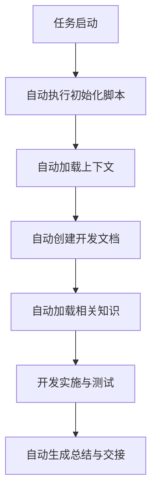

# AI开发流程自动化增强方案

## 问题背景

当前AI开发流程存在以下问题：
1. AI开发者未能自动执行文档生成脚本
2. 会话初始化步骤不完整，缺乏标准化
3. 跨会话的知识传递有断点
4. 开发准备与实施流程不够自动化
5. 缺乏对既有代码的全面理解

## 解决方案

### 1. 工作流自动化增强方案

我们设计了一个全自动化AI开发工作流，通过以下机制确保AI开发者从任务接收到完成验证的全过程都能自动化且高质量地执行：



### 2. 会话初始化脚本

创建`session_init.js`脚本，该脚本将作为每个AI开发会话的必要启动步骤，执行以下操作：

```javascript
/**
 * AI开发会话初始化脚本
 * 自动执行整个开发流程所需的准备工作
 */
const fs = require('fs');
const path = require('path');
const { execSync } = require('child_process');

// 参数解析
const taskCode = process.argv[2]; // 如A8
const taskDescription = process.argv[3] || "未命名任务";

// 1. 日志初始化
console.log(`开始初始化开发会话 - 任务代号: ${taskCode}`);

// 2. 任务信息获取（从索引文档）
function getTaskInfo(taskCode) {
  const indexContent = fs.readFileSync('索引.md', 'utf8');
  // 从索引文档解析出任务描述、必读文档和参考文档
  const taskRegex = new RegExp(`\\| ${taskCode} \\| ([^|]+)\\| ([^|]+)\\| ([^|]+)\\|`);
  const match = indexContent.match(taskRegex);
  
  if (match) {
    return {
      description: match[1].trim(),
      requiredDocs: match[2].trim().split(',').map(d => d.trim()),
      referenceDocs: match[3].trim().split(',').map(d => d.trim())
    };
  }
  
  return {
    description: taskDescription,
    requiredDocs: ['00-README.md', '70-AI工业级开发流程规范.md'],
    referenceDocs: []
  };
}

// 3. 文档生成
function generateDocuments(taskCode, taskDescription) {
  try {
    // 运行gen_dev_docs.cjs脚本生成标准文档集
    execSync(`node gen_dev_docs.cjs "${taskCode}" "${taskDescription}"`, {stdio: 'inherit'});
    console.log('✅ 开发文档生成完成');
  } catch (err) {
    console.error('❌ 文档生成失败:', err.message);
    // 尝试使用备选方案创建文档
    createFallbackDocuments(taskCode, taskDescription);
  }
}

// 4. 查找前序开发会话记录
function findPreviousSessions() {
  const aiDevDocsDir = path.join(__dirname, 'AI开发文档');
  const dirs = fs.readdirSync(aiDevDocsDir).filter(
    dir => fs.statSync(path.join(aiDevDocsDir, dir)).isDirectory()
  );
  
  // 按创建时间排序，找出最近的3个会话
  const sortedDirs = dirs.sort((a, b) => {
    const statA = fs.statSync(path.join(aiDevDocsDir, a));
    const statB = fs.statSync(path.join(aiDevDocsDir, b));
    return statB.mtime.getTime() - statA.mtime.getTime();
  }).slice(0, 3);
  
  console.log('找到最近的开发会话:');
  sortedDirs.forEach(dir => console.log(`- ${dir}`));
  
  return sortedDirs;
}

// 5. 生成上下文加载指南
function generateContextGuide(taskInfo, previousSessions) {
  const guide = [
    '# 开发上下文加载指南',
    '',
    `## 当前任务: ${taskCode} - ${taskInfo.description}`,
    '',
    '## 必读文档',
    ...taskInfo.requiredDocs.map(doc => `- ${doc}`),
    '',
    '## 参考文档',
    ...taskInfo.referenceDocs.map(doc => `- ${doc}`),
    '',
    '## 前序会话知识',
    ...previousSessions.map(session => `- ${session}/README.md`),
    ...previousSessions.map(session => `- ${session}/${taskCode.charAt(0)}-会话总结.md`),
    '',
    '## 开发流程指南',
    '1. 先阅读必读文档，了解任务要求',
    '2. 再阅读前序会话知识，理解已有工作',
    '3. 研究当前代码库状态，查看相关组件和文件',
    '4. 确认开发计划并补充到开发计划文档中',
    '5. 按照小步快跑原则实现功能',
    '6. 编写并执行测试用例验证功能',
    '7. 完成知识传递文档和会话总结',
    '',
    '## 自动化验证要求',
    '所有开发工作必须通过自动化测试验证，验证步骤如下:',
    '1. 单元测试: 确保核心功能正确',
    '2. 集成测试: 确保与其他组件交互正常',
    '3. 性能测试: 确保性能满足要求',
    '4. 兼容性测试: 确保在各种环境下正常运行'
  ].join('\n');
  
  const guidePath = path.join(__dirname, 'AI开发文档', `${taskCode}-${taskInfo.description}`, 'context_guide.md');
  fs.writeFileSync(guidePath, guide);
  
  console.log(`✅ 上下文加载指南生成完毕: ${guidePath}`);
  return guidePath;
}

// 6. 生成代码库状态报告
function generateCodebaseReport() {
  try {
    // 1. 获取项目目录结构
    const dirStructure = execSync('find . -type d -not -path "*/\\.*" | sort').toString();
    
    // 2. 获取关键文件列表
    const jsFiles = execSync('find . -name "*.js" -o -name "*.ts" -o -name "*.wxml" -o -name "*.wxss" | grep -v "node_modules" | sort').toString();
    
    // 3. 获取依赖信息
    let dependencies = "无法获取依赖信息";
    try {
      dependencies = execSync('cat package.json | grep -A 20 "dependencies"').toString();
    } catch (e) {
      // 可能没有package.json
    }
    
    const report = [
      '# 代码库状态报告',
      '',
      '## 目录结构',
      '```',
      dirStructure,
      '```',
      '',
      '## 关键文件',
      '```',
      jsFiles,
      '```',
      '',
      '## 依赖信息',
      '```',
      dependencies,
      '```',
      '',
      '## 当前代码状态',
      '请根据上述信息和前序会话文档，分析当前代码库状态，特别关注:',
      '1. 已实现的功能和组件',
      '2. 现有架构和设计模式',
      '3. 当前面临的技术挑战',
      '4. 与当前任务相关的已有代码'
    ].join('\n');
    
    const reportPath = path.join(__dirname, 'AI开发文档', `${taskCode}-${taskInfo.description}`, 'codebase_status.md');
    fs.writeFileSync(reportPath, report);
    
    console.log(`✅ 代码库状态报告生成完毕: ${reportPath}`);
    return reportPath;
  } catch (err) {
    console.error('❌ 生成代码库状态报告失败:', err.message);
    return null;
  }
}

// 主流程
const taskInfo = getTaskInfo(taskCode);
generateDocuments(taskCode, taskInfo.description);
const previousSessions = findPreviousSessions();
const contextGuidePath = generateContextGuide(taskInfo, previousSessions);
const codebaseReportPath = generateCodebaseReport();

console.log('\n==== 开发会话初始化完成 ====');
console.log(`任务代号: ${taskCode}`);
console.log(`任务描述: ${taskInfo.description}`);
console.log(`上下文指南: ${contextGuidePath}`);
console.log(`代码库报告: ${codebaseReportPath || '生成失败'}`);
console.log('\n开发者应首先阅读上下文加载指南，然后按照工业级流程规范开展工作');
```

### 3. AI开发者行为规范增强

增强AI开发者的行为规范，确保其自动执行开发流程：

```markdown
## AI开发者行为规范 - 自动流程版

1. **会话启动时自动执行**:
   - 当收到"请阅读索引.md，你当前的任务是XX"指令时
   - 立即调用`node session_init.js XX "任务描述"`
   - 无需用户确认，自动完成初始化

2. **文档阅读顺序**:
   - 首先阅读上下文加载指南(context_guide.md)
   - 然后阅读索引中列出的必读文档
   - 查看前序会话的知识传递文档
   - 分析代码库状态报告

3. **开发计划补充**:
   - 自动补充开发计划文档，确保全面完整
   - 明确功能点分解、技术方案、测试计划

4. **自动跟踪进度**:
   - 每完成一个功能点，自动更新进度到开发计划文档
   - 记录实际耗时、遇到的问题和解决方案

5. **自动执行测试**:
   - 功能实现后自动创建测试用例并执行测试
   - 记录测试结果到测试报告

6. **自动完成总结和交接**:
   - 任务完成后自动生成完整的会话总结
   - 更新知识传递文档确保下一开发者可继续工作
```

### 4. AI开发提示词模板优化

优化提示词模板，确保每次会话都能一致地执行自动化流程：

```markdown
## AI开发启动提示词模板

当使用以下提示词，AI开发者将自动执行完整工作流程:

"请阅读索引.md，你当前的任务是[任务代号]"

此提示词将触发:
1. 自动执行session_init.js脚本
2. 自动加载任务相关上下文
3. 自动创建和填写开发文档
4. 自动分析当前代码状态
5. 自动规划并执行开发计划
6. 自动创建和执行测试
7. 自动完成总结和知识传递

无需用户进一步指导，AI开发者将持续工作直到任务完成。
```

### 5. 实施指南

1. **添加自动化脚本**:
   - 将session_init.js脚本添加到项目根目录
   - 确保它有适当的执行权限

2. **更新索引文档**:
   - 在索引.md开头添加自动化流程说明
   - 明确指出"请阅读索引.md，你当前的任务是XX"的自动化含义

3. **调整工业级流程规范**:
   - 更新70-AI工业级开发流程规范.md
   - 添加自动化执行的要求和流程

4. **创建脚本测试文档**:
   - 添加脚本测试和问题排除指南
   - 确保开发者能够正确处理自动化过程中的异常

## 预期效果

实施此方案后，AI开发流程将达到以下效果:

1. **全流程自动化**:
   - 从任务接收到完成验证的整个过程无需人工干预
   - 所有文档自动创建和更新

2. **知识无缝传递**:
   - 自动加载前序会话的知识和经验
   - 确保连续性和一致性

3. **质量标准提升**:
   - 自动执行测试和验证
   - 确保所有功能都符合标准

4. **效率显著提升**:
   - 减少重复工作和手动步骤
   - 开发者专注于核心创造性工作

## 后续优化方向

1. **智能化加载**:
   - 根据任务特点动态调整加载的文档和代码
   - 优化token使用效率

2. **自适应测试**:
   - 根据功能特点自动生成针对性测试用例
   - 实现测试用例的自我优化

3. **跨会话记忆增强**:
   - 开发更高效的记忆提取和应用机制
   - 减少重复学习成本 